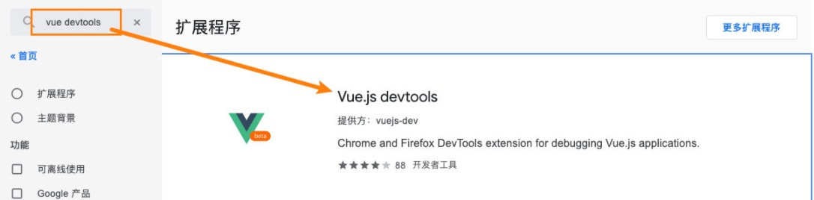
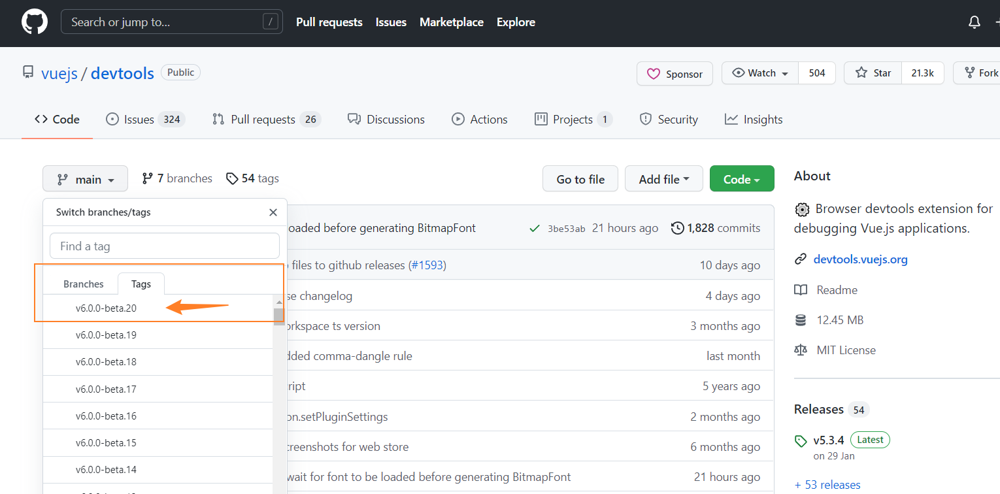
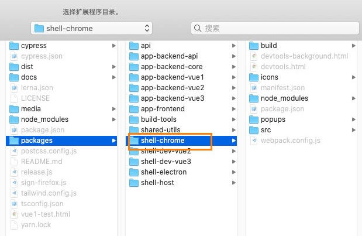

vue 其实提供了一个 devtools，方便我们对组件或者 vuex 进行调试：

* 我们需要安装 beta 版本支持 vue3，目前是 6.0.0 beta20；

　　它有两种常见的安装方式：

* 方式一：通过 chrome 的商店；

* 方式二：手动下载代码，编译、安装；

　　

　　方式一：通过 Chrome 商店安装：

* 由于某些原因我们可能不能正常登录 Chrome 商店，所以可以选择第二种；

　　

　　

　　方式二：手动下载代码，编译、安装

* [vuejs/devtools at v6.0.0-beta.20 (github.com)](https://github.com/vuejs/devtools/tree/v6.0.0-beta.20) 下载代码；

* 执行 yarn install 安装相关的依赖；

* 执行 yarn run build 打包；

　　

　　

