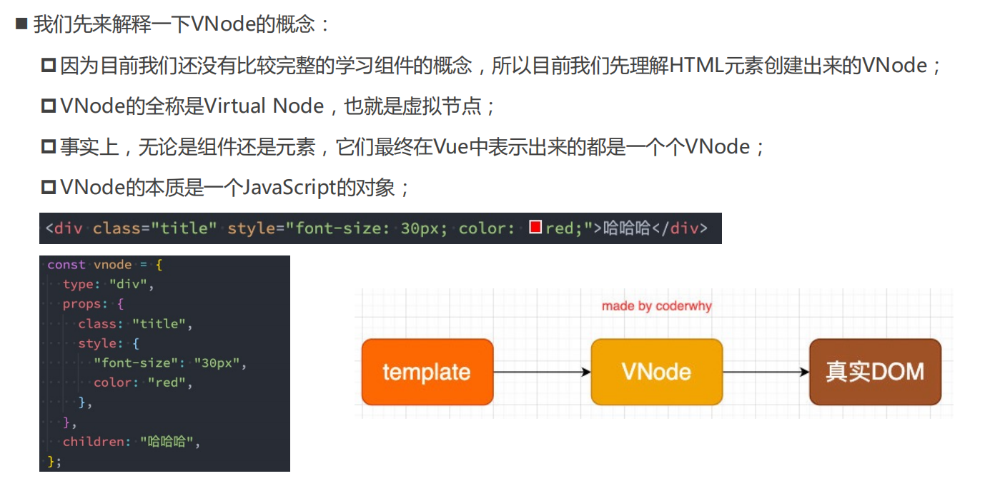
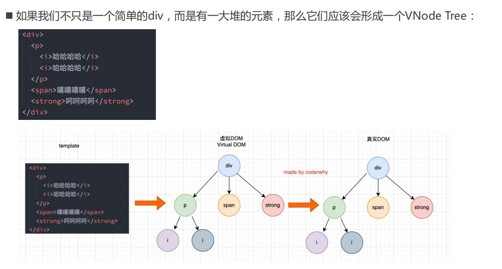
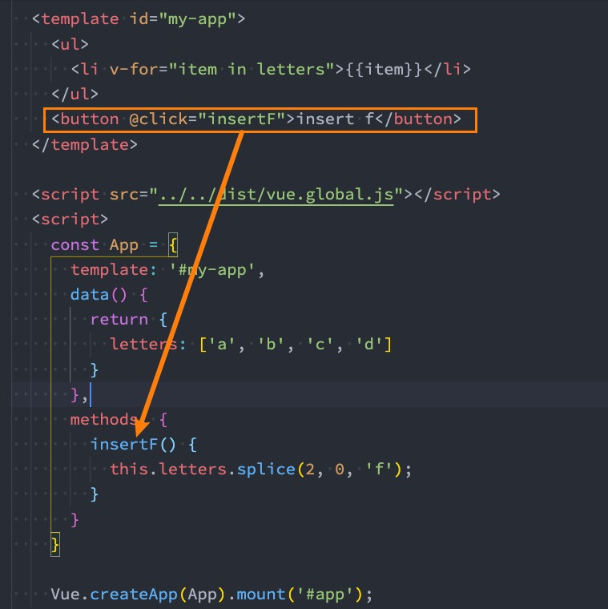
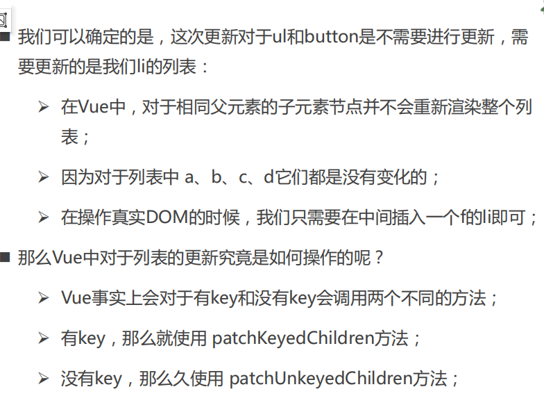
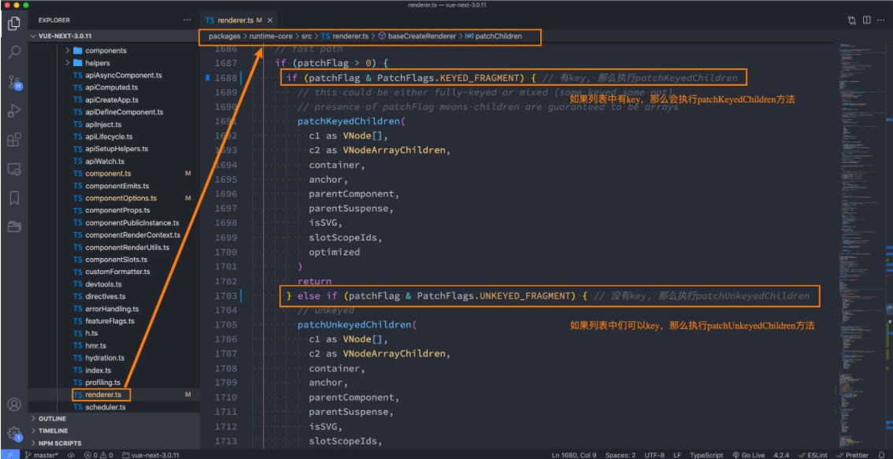
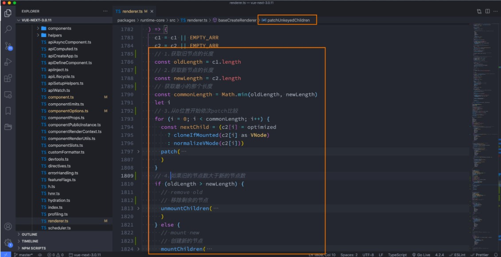
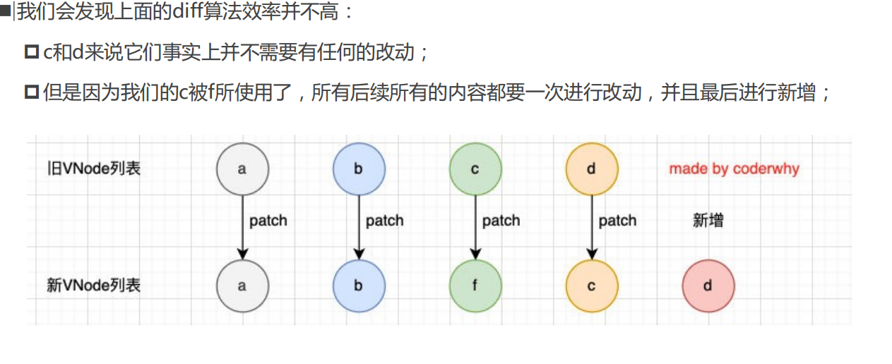
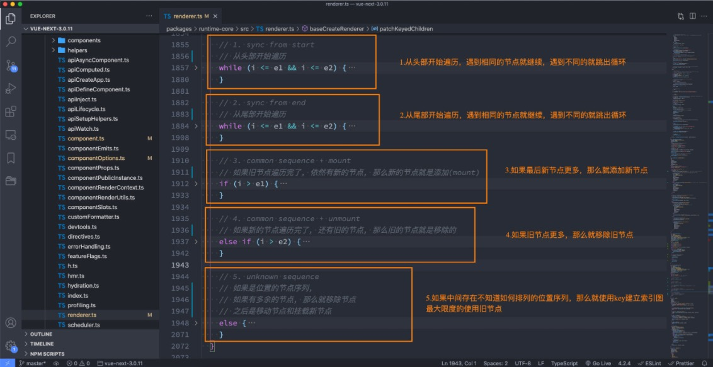
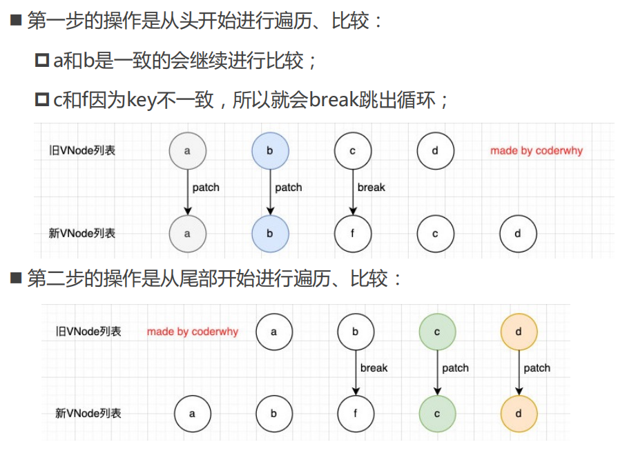
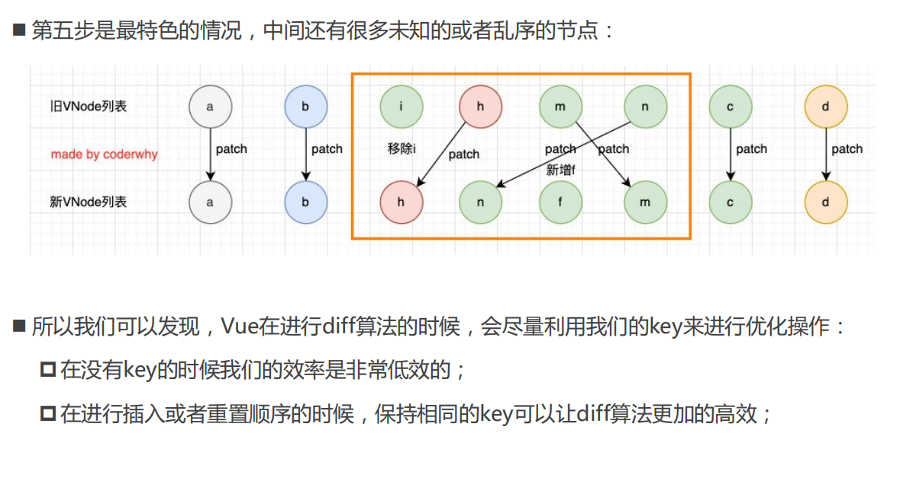

## 认识 VNode

　　

　　

## 虚拟 DOM

　　

## 插入 F 的案例

　　

　　

## Vue 源码对于 key 的判断

　　

### 没有 key 的操作（源码）

　　

#### 没有 key 的过程如下

　　

### 有 key 执行操作（源码）

　　

　　

#### 有 key 的 diff 算法如下（一）

　　

#### 有 key 的 diff 算法如下（二）

　　

#### 有 key 的 diff 算法如下（三）

　　
