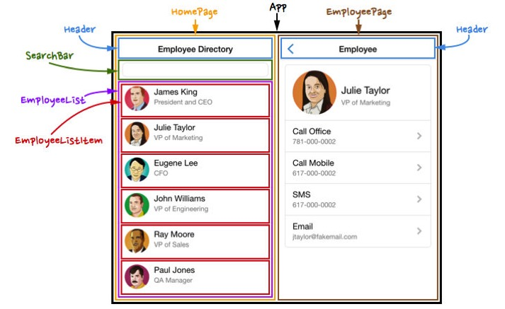
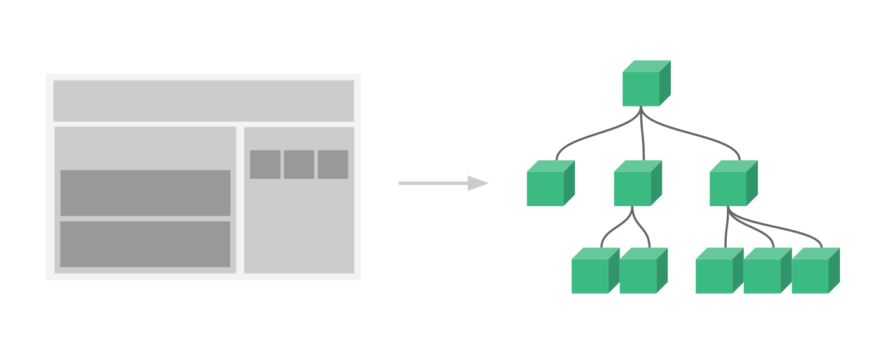
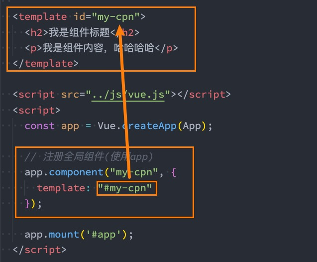
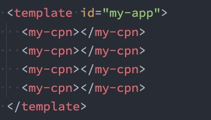
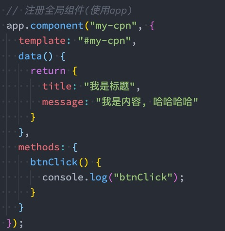
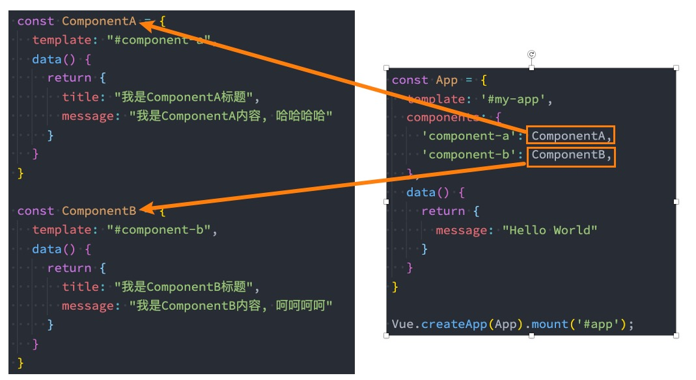
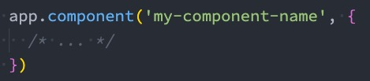
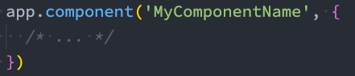
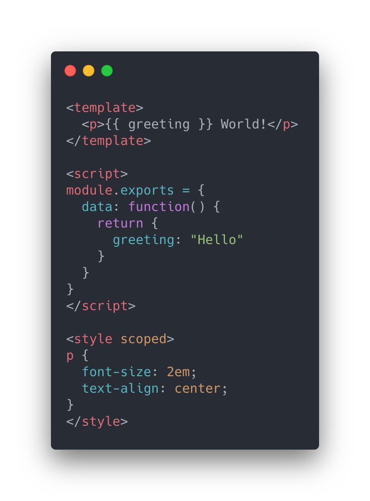

# 组件化开发

## 认识组件化开发

　　**组件化也是类似的思想：**

* 如果我们将**一个页面中所有的处理逻辑全部放在一起**，处理起来就会变得**非常复杂**，而且不利于**后续的管理以及扩展**；

* 但如果，我们将**一个页面拆分成一个个小的功能块**，每个功能块完成属于**自己这部分独立的功能**，那么之后整个页面的**管理和维护**就变得非常容易了；

* 如果我们将一个个功能块拆分后，就可以像**搭建积木一下来搭建我们的项目**；

　　

　　

## 组件化开发

　　**现在可以说整个的大前端开发都是组件化的天下**，无论从**三大框架（Vue、React、Angular）**，还是跨平台方案的 **Flutter**，甚至是**移动端**都在转向组件化开发，包括**小程序的开发**也是采用组件化开发的思想。

　　所以，学习组件化最重要的是**它的思想**，每个框架或者平台可能实现方法不同，但是思想都是一样的。

　　我们需要通过组件化的思想来思考整个应用程序：

* 我们将**一个完整的页面**分成**很多个组件**；

* **每个组件**都用于实现**页面的一个功能块**；

* 而**每一个组件**又可以进行**细分**；

* 而**组件本身**又可以在**多个地方进行复用**；

　　

## Vue 的组件化

　　**组件化是 Vue、React、Angular 的核心思想**：

* 前面我们的 createApp 函数传入了一个**对象 App**，这个对象其实本质上就是**一个组件**，也是我们应用程序的**根组件**；

* 组件化提供了一种抽象，让我们可以开发出**一个个独立可复用的小组件**来构造我们的应用；

* 任何的应用都会被抽象成一颗**组件树**；

　　

　　

## 注册组件的方式

　　如果我们现在有一部分**内容（模板、逻辑等）**，我们希望将这部分内容抽取到一个**独立的组件**中去维护，这个时候如何注册一个组件呢？

　　我们先从简单的开始谈起，比如下面的模板希望抽离到一个单独的组件：

```html
<h2>{{title}}</h2>
<p>{{desc}}</p>
```

　　 注册组件分成两种：

* **全局组件**：在任何其他的组件中都可以使用的组件；

* **局部组件**：只有在注册的组件中才能使用的组件；

　　

### 注册全局组件

* 全局组件需要使用我们**全局创建的 app 来注册组件**；

* 通过 **component 方法**传入**组件名称、组件对象**即可注册一个全局组件了；

* 之后，我们可以在 **App 组件的 template** 中直接**使用这个全局组件**：

　　

　　

### 全局组件的逻辑

　　当然，我们组件本身也可以有自己的代码逻辑：

* 比如自己的 data、computed、methods 等等

　　

　　

### 注册局部组件

　　全局组件往往是在应用程序一开始就会**全局组件**完成，那么就意味着如果**某些组件我们并没有用到，也会一起被注册**：

* 比如我们注册了**三个全局组件**：ComponentA、ComponentB、ComponentC；

* 在开发中我们只使用了 **ComponentA、Component****B**，如果 **ComponentC** **没有用到**但是我们依然在全局进行了注册，那么就意味着**类似于 webpack 这种打包工具****在打包我们的项目**时，我们**依然会对其进行打包**；

* 这样最终打包出的 JavaScript 包就会有**关于 ComponentC 的内容**，用户在下载对应的 JavaScript 时也**会增加包的大小**；

　　所以在开发中我们通常使用组件的时候采用的都是局部注册：

* **局部注册**是在我们需要使用到的组件中，通过 **components 属性选项**来进行注册；

* 比如之前的 App 组件中，我们有 data、computed、methods 等选项了，事实上还可以有一个 **components 选项**；

* 该 components 选项对应的**是****一个对象**，对象中的键值对是 **组件的名称: 组件对象**；

　　

　　

　　

## 组件的名称

　　在通过 app.component 注册一个组件的时候，第一个参数是组件的名称，定义组件名的方式有两种：

　　**方式一：使用 kebab-case（短横线分割符）**

* 当使用 kebab-case (短横线分隔命名) 定义一个组件时，你也必须在引用这个自定义元素时使用 kebab-case，例如 <my-component-name>；
* 

　　**方式二：使用 PascalCase（驼峰标识符）**

* 当使用 PascalCase (首字母大写命名) 定义一个组件时，你在引用这个自定义元素时两种命名法都可以使用。也就是说 <my-component-name> 和 <MyComponentName> 都是可接受的
* 

　　

　　

# Vue 的开发模式

　　目前我们使用 vue 的过程都是**在 html 文件中**，通过 **template 编写自己的模板、脚本逻辑、样式**等。

　　**但是随着项目越来越复杂，我们会采用组件化的方式来进行开发：**

* 这就意味着**每个组件**都会有自己的**模板、脚本逻辑、样式**等；

* 当然我们依然可以把它们**抽离到单独的 js、css 文件中**，但是**它们还是会分离开来**；

* 也包括我们的 script 是在**一个全局的作用域下**，很容易**出现命名冲突的问题**；

* 并且我们的代码为了适配一些浏览器，必须**使用 ES5 的语法**；

* 在我们编写代码完成之后，依然需要**通过工具对代码进行构建、代码**；

　　所以在真实开发中，我们可以通过一个**后缀名为 .vue** 的 **single-file components (单文件组件****)** 来解决，并且可以使用 webpack 或者 vite 或者 rollup 等构建工具来对其进行处理

　　

## 单文件的特点

　　在这个组件中我们可以获得非常多的特性：

* 代码的高亮；
* ES6、CommonJS 的模块化能力；
* 组件作用域的 CSS；
* 可以使用预处理器来构建更加丰富的组件，比如 TypeScript、Babel、Less、Sass 等；

　　
