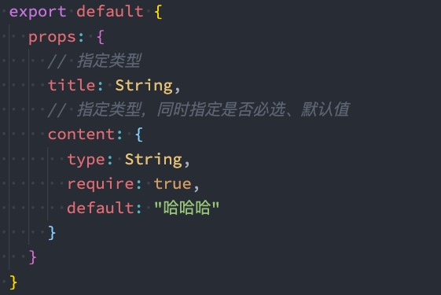

# 认识组件的嵌套

　　**前面我们是将所有的逻辑放到一个 App.vue 中：**

* 在之前的案例中，我们只是**创建了一个组件 App**；
* 如果我们一个应用程序**将所有的逻辑都放在一个组件中**，那么这个组件就会变成**非常的臃肿和难以维护**；
* 所以组件化的核心思想应该是**对组件进行拆分**，拆分成**一个个小的组件**；
* 再**将这些组件组合嵌套在一起**，最终形成**我们的应用程序**；

　　我们来分析一下下面代码的嵌套逻辑，假如我们将所有的代码逻辑都放到一个 App.vue组件中：

* 我们会发现，将所有的代码逻辑全部放到一个组件中，代码是非常的臃肿和难以维护的。
* 并且在真实开发中，我们会有更多的内容和代码逻辑，对于扩展性和可维护性来说都是非常差的。
* 所以，在真实的开发中，我们会对组件进行拆分，拆分成一个个功能的小组件。
* 

　　

# 组件的拆分

　　我们可以按照如下的方式进行拆分：

　　

　　按照如上的拆分方式后，我们开发对应的逻辑只需要去对应的组件编写就可。

　　

　　

# 组件的通信

　　**上面的嵌套逻辑如下，它们存在如下关系：**

* App 组件是 Header、Main、Footer 组件的**父组件**；
* Main 组件是 Banner、ProductList 组件的**父组件**；

　　在开发过程中，我们会经常遇到需要组件之间相互进行通信：

* 比如 **App 可能使用了多个 Header**，每个地方的 **Header 展示的内容不同**，那么我们就需要使用者**传递给 Header一些数****据**，让其进行展示；
* 又比如我们在 Main 中一次性**请求了 Banner 数据和 ProductList 数据**，那么就需要**传递给它们**来进行展示；
* 也可能是**子组件中发生了事件**，需要**由父组件来完成某些操作**，那就需要**子组件向父组件传递事件**；

　　总之，在一个 Vue 项目中，组件之间的通信是非常重要的环节，所以接下来我们就具体学习一下组件之间是如何相互之间传递数据的；	

　　

## 父子组件之间通信的方式

　　父子组件之间如何进行通信呢？

* 父组件传递给子组件：**通过 props 属性**；
* 子组件传递给父组件：**通过 $emit 触发事件**；

　　

　　

### 父组件传递给子组件（父传子）

　　在开发中很常见的就是**父子组件之间通信**，比如父组件有一些数据，需要子组件来进行展示：

* 这个时候我们可以**通过 props 来完成组件之间的通信**；

　　**什么是 Props 呢？**

* Props 是你可以在组件上**注册一些自定义的 attribute**；

* 父组件**给这些 attribute 赋值**，**子组件通过 attribute 的名称获取到对应的**值；

　　**Props 有两种常见的用法：**

* **方式一：字符串数组**，数组中的字符串就是 attribute 的名称；
* **方式二：对象类型**，对象类型我们可以在指定 attribute 名称的同时，指定它需要传递的类型、是否是必须的、默认值等等；

#### Props 的数组用法

　　

　　

#### Props 的对象用法

　　数组用法中我们**只能说明传入的 attribute 的名称**，并**不能对其进行任何形式的限制**，接下来我们来看一下**对象的写法**是如何让我们的 props 变得更加完善的。	

　　**当使用对象语法的时候，我们可以对传入的内容限制更多：**

*  比如指定传入的 **attribute 的类型**；
* 比如指定传入的 **attribute 是否是必传的**；
* 比如指定没有传入时，**attribute 的默认值**；

　　

　　

##### 细节一：那么 type 的类型都可以是哪些呢？

* String
* Number
* Boolean
* Array
* Object
* Date
* Function
* Symbol

　　

##### 细节二：对象类型的其他写法

　　

　　

##### 细节三：Prop 的大小写命名

　　**Prop 的大小写命名(camelCase vs kebab-case)**

* HTML 中的 **attribute 名是大小写不敏感的**，所以**浏览器会把所有大写字符解释为小写字符**；

* 这意味着当你**使用 DOM 中的模板**时，**camelCase (驼峰命名法) 的 prop 名需要使用其等价的 kebab-case (短横线分隔命名) 命名**；
* 

　　

#### 非 Prop 的 Attribute

　　**什么是非 Prop 的 Attribute 呢？**

* 当我们**传递给一个组件某个属性**，但是**该属性并没有定义对应的 props 或者 emits 时**，就称之为 **非 Prop 的Attribute**；

* 常见的包括 **class、style、id 属性**等；

　　​**Attribute 继承**

* 当**组件有单个根节点时**，**非 Prop 的 Attribute 将自动添加到根节点的 Attribute 中**：

　　

　　

##### 禁用 Attribute 继承和多根节点

　　**如果我们不希望组件的根元素继承 attribute，可以在组件中设置 inheritAttrs: false：**

* 禁用 attribute 继承的**常见情况**是**需要将 attribute 应用于根元素之外的其他元****素**；
* 我们可以通过 **$attrs 来访问所有的 非 props 的 attribute**；
* 

　　**多个根节点的 attribute**

* **多个根节点的 attribute 如果没有显示的绑定**，那么会报警告，我们**必须手动的指定要绑定到哪一个属性**上：
* 

　　

　　

　　

### 子组件传递给父组件（子传父）

　　**什么情况下子组件需要传递内容到父组件呢？**

* 当**子组件有一些事件发生**的时候，比如在组件中发生了点击，父组件需要切换内容；

* 子组件**有一些内容想要传递给父组****件**的时候；

　　**我们如何完成上面的操作呢？**

* 首先，我们需要在**子组件中定义好在某些情况下触发的事件名称**；

* 其次，在**父组件中以 v-on 的方式传入要监听的事件名****称**，并且绑定到对应的方法中；

* 最后，在子组件中发生某个事件的时候，**根据事件名称触发对应的事件；**

　　

#### 自定义事件的流程

　　我们封装一个 CounterOperation.vue 的组件：

* 内部其实是监听两个按钮的点击，点击之后通过 **this.$emit** 的方式发出去事件；

　　

　　

##### 自定义事件的参数和验证

　　自定义事件的时候，我们也可以传递一些参数给父组件：

　　

　　在 vue3 当中，我们可以对传递的参数进行验证：

　　

　　

#### 组件间通信案例练习

　　商品页面的切换

　　

　　App.vue

```html
<template>
  <div>
    <tab-control :titles="titles" @titleClick="titleClick"></tab-control>
    <h2>{{contents[currentIndex]}}</h2>
  </div>
</template>

<script>
  import TabControl from './TabControl.vue';

  export default {
    components: {
      TabControl
    },
    data() {
      return {
        titles: ["衣服", "鞋子", "裤子"],
        contents: ["衣服页面", "鞋子页面", "裤子页面"],
        currentIndex: 0
      }
    },
    methods: {
      titleClick(index) {
        this.currentIndex = index;
      }
    }
  }
</script>

<style scoped>

</style>
```

　　TabControl.vue

```html
<template>
  <div class="tab-control">
    <div class="tab-control-item" 
         :class="{active: currentIndex === index}"
         v-for="(title, index) in titles" 
         :key="title"
         @click="itemClick(index)">
      <span>{{title}}</span>
    </div>
  </div>
</template>

<script>
  export default {
    emits: ["titleClick"],
    props: {
      titles: {
        type: Array,
        default() {
          return []
        }
      }
    },
    data() {
      return {
        currentIndex: 0
      }
    },
    methods: {
      itemClick(index) {
        this.currentIndex = index;
        this.$emit("titleClick", index);
      }
    }
  }
</script>

<style scoped>
  .tab-control {
    display: flex;
  }

  .tab-control-item {
    flex: 1;
    text-align: center;
  }

  .tab-control-item.active {
    color: red;
  }

  .tab-control-item.active span {
    border-bottom: 3px solid red;
    padding: 5px 10px;
  }
</style>
```

　　

　　

## 非父子组件的通信

　　在开发中，我们构建了组件树之后，除了**父子组件之间的通信**之外，还会有**非父子组件之间的通信**。

　　这里我们主要讲两种方式：

* **Provide/Inject；**

* **Mitt 全局事件总线；**

　　

### Provide/Inject

　　Provide/Inject 用于**非父子组件之间共享数据**：

* 比如有**一些深度嵌套的组件，子组件想要获取父组件的部分内容**；

* 在这种情况下，如果我们仍然**将 props 沿着组件链逐级传递**下去，就会非常的麻烦；

　　对于这种情况下，**我们可以使用 Provide 和 Inject ：**	

* 无论层级结构有多深，父组件都可以作为其所有子组件的**依赖提供者**；

* 父组件有一个 **provide 选项**来提供数据；

* 子组件有一个 **inject 选项**来开始使用这些数据；

　　实际上，你可以将依赖注入看作是“**long range props**”，除了：

* 父组件不需要知道哪些子组件使用它 provide 的 property

* 子组件不需要知道 inject 的 property 来自哪里

　　

　　

#### Provide 和 Inject 基本使用

　　我们开发一个这样的结构：

　　

　　

　　

#### Provide 和 Inject 函数的写法

　　如果 Provide 中提供的一些数据是，那么我们可能会想要**通过 this 来获取**：

　　这个时候会报错：

* 这里给大家留一个思考题，我们的 this 使用的是哪里的 this？

　　

　　

　　

　　

#### 处理响应式数据

　　我们先来验证一个结果：**如果我们修改了 this.names 的内容，那么使用 length 的子组件会不会是响应式的？**

　　我们会发现对应的子组件中是**没有反应的**：

* 这是因为当我们**修改了 names 之后**，之前在 provide 中引入的 **this.names.length 本身并不是响应式的**；

　　**那么怎么样可以让我们的数据变成响应式的呢？**

* 非常的简单，我们可以使用**响应式的一些 API** 来完成这些功能，比如说 **computed 函数**；

* 当然，这个 computed 是 **vue3 的新特性**，在后面我会专门讲解，这里大家可以先直接使用一下；

　　**注意：我们在使用 length 的时候需要获取其中的 value**

* 这是因为 **computed 返回的是一个 ref 对象**，需要取出其中的 **value 来使用**；

　　

　　

　　

　　

### 全局事件总线 mitt 库

　　**Vue3 从实例中移除了 $on、$ off 和 $once 方法，所以我们如果希望继续使用全局事件总线，要通过第三方的库：**

* Vue3 官方有推荐一些库，例如 [mitt](https://github.com/developit/mitt) 或 [tiny-emitter](https://github.com/scottcorgan/tiny-emitter)；

* 这里我们主要讲解一下 **mitt 库**的使用；

　　首先，我们需要先安装这个库：

　　`npm install mitt`

　　其次，我们可以封装一个工具 eventbus.js：

　　全局事件总线 mitt 库

　　

　　

#### 使用事件总线工具

　　在项目中可以使用它们：

* 我们在 Home.vue 中监听事件；

* 我们在 App.vue 中触发事件；

　　

　　

#### Mitt 的事件取消

　　在某些情况下我们可能希望**取消掉之前注册的函数监听：**

　　

　　

　　

　　

# 插槽 Slot

## 认识插槽 Slot

　　**在开发中，我们会经常封装一个个可复用的组件：**

* 前面我们会**通过 props 传递**给组件一些数据，让组件来进行展示；

* 但是为了让这个组件具备**更强的通用性**，我们**不能将组件中的内容限制为固定的 div、span** 等等这些元素；

* 比如某种情况下我们使用组件，希望组件显示的是**一个按钮**，某种情况下我们使用组件希望显示的是**一张图片**；

* 我们应该让使用者可以决定**某一块区域到底存放什么内容和元素**；

　　**举个栗子：假如我们定制一个通用的导航组件 - NavBar**

* 这个组件分成三块区域：**左边-中间-右边**，每块区域的内容是不固定；
* 左边区域可能显示一个菜单图标，也可能显示一个返回按钮，可能什么都不显示；
* 中间区域可能显示一个搜索框，也可能是一个列表，也可能是一个标题，等等；
* 右边可能是一个文字，也可能是一个图标，也可能什么都不显示；
* 

　　

## 如何使用插槽 slot？

　　**这个时候我们就可以来定义插槽 slot：**

* 插槽的使用过程其实是**抽取共性、预留不同**；

* 我们会将**共同的元素、内容依然在组件内**进行封装；

* 同时会将**不同的元素使用 slot 作为占位**，让外部决定到底显示什么样的元素；

　　**如何使用 slot 呢？**

* Vue 中将 **<slot> 元素作为承载分发内容****的出口**；
* 在封装组件中，使用**特殊的元素 <slot>** 就可以为封装组件**开启一个插槽**；
* 该插槽**插入什么内容取决于父组件**如何使用；

　　

## 插槽的基本使用

* 我们一个组件 MySlotCpn.vue：该组件中有一个插槽，我们可以在插槽中放入需要显示的内容；

* 我们在 App.vue 中使用它们：我们可以插入普通的内容、html 元素、组件元素，都可以是可以的；

　　

　　

　　

### 插槽的默认内容

* 有时候我们希望在使用插槽时，如果**没有插入对应的内容，那么我们需要显示一个****默认的内容**：

* 当然这个默认的内容只会在没有提供插入的内容时，才会显示
* 

　　

　　

### 多个插槽的效果

　　我们先测试一个知识点：如果一个组件中**含有多个插槽**，我们插入多个内容时是什么效果？

* 我们会发现默认情况下每个插槽都会获取到我们插入的内容来显示；

　　

　　

　　

## 具名插槽的使用

　　事实上，我们希望达到的效果是插槽对应的显示，这个时候我们就可以使用 **具名插槽**：

* 具名插槽顾名思义就是**给插槽起一个名字**，<slot> 元素有一个**特殊的 attribute：name**；

* 一个**不带 name 的 slot，会带有隐含的名字 default；**

　　

　　

　　

### 动态插槽名

　　**什么是动态插槽名呢？**

* 目前我们使用的插槽名称都是固定的；
* 比如 v-slot:left、v-slot:center 等等；
* 我们可以通过 **v-slot:[dynamicSlotName]**方式动态绑定一个名称；

　　App.vue

　　

　　NavBar.vue

　　

　　

### 具名插槽使用的时候缩写

　　**具名插槽使用的时候缩写：**

* 跟 v-on 和 v-bind 一样，**v-slot 也有缩写**；

* 即**把参数之前的所有内容 (v-slot:) 替换为字符 #**；
* 

　　

　　

## 作用域插槽

### 渲染作用域

　　**在 Vue 中有渲染作用域的概念：**

* 父级模板里的所有内容都是**在父级作用域中编译**的；
* 子模板里的所有内容都是**在子作用域中编译**的；

　　如何理解这句话呢？我们来看一个案例：

* 在我们的案例中 ChildCpn 自然是可以让问自己作用域中的 title 内容的；
* 但是在 App 中，是访问不了 ChildCpn 中的内容的，因为它们是跨作用域的访问；

　　

　　

### 作用域插槽的使用

　　但是有时候我们希望插槽可以访问到子组件中的内容​是非常重要的：

* 当一个组件被**用来渲染一个****数组元素**时，我们**使用插槽**，并且**希望插槽中没有显示每项的内容**；

* 这个 Vue 给我们提供了**作用域插槽**；

　　我们来看下面的一个案例：

1. 在 App.vue 中定义好数据

2. 传递给 ShowNames 组件中

3. ShowNames 组件中遍历 names 数据

4. 定义插槽的 prop

5. 通过 v-slot:default 的方式获取到 slot 的 props

6. 使用 slotProps 中的 item 和 index

　　

　　

　　

### 独占默认插槽的缩写

　　如果我们的插槽是默认插槽 default，那么在使用的时候 v-slot:default="slotProps"可以简写为 v-slot="slotProps"：

　　

　　并且如果我们的插槽只有默认插槽时，组件的标签可以被当做插槽的模板来使用，这样，我们就可以将 v-slot 直接用在组件上：

　　

　　

　　

### 默认插槽和具名插槽混合

　　但是，如果我们有默认插槽和具名插槽，那么按照完整的 template 来编写。

　　

　　只要出现多个插槽，请始终为所有的插槽使用完整的基于 <template> 的语法：

　　

　　

　　

　　

　　

# 动态组件

## 切换组件案例

　　比如我们现在想要实现了一个功能：

* 点击一个 tab-bar，切换不同的组件显示；
* 

　　这个案例我们可以通过两种不同的实现思路来实现：

* 方式一：通过 **v-if 来判断**，显示不同的组件；

* **方式二：动态组件的方式；**

　　

### v-if 显示不同的组件

　　

　　

### 动态组件的实现

　　动态组件是使用 **component 组件**，通过一个**特殊的 attribute:   is** 来实现：

　　

　　这个 currentTab 的值需要是什么内容呢？

* 可以是通过 **component 函数注册****的组件**（全局）；

* 在一个**组件对象的 components 对象中注册****的组件**（局部）；

　　

### 切换组件案例源码

```html
<template>
  <div>
    <button v-for="item in tabs" :key="item"
            @click="itemClick(item)"
            :class="{active: currentTab === item}">
      {{item}}
    </button>

    <!-- 2.动态组件 -->
    <keep-alive include="home,about">
      <component :is="currentTab"
                 name="coderwhy"
                 :age="18"
                 @pageClick="pageClick">
      </component>
    </keep-alive>
  

    <!-- 1.v-if的判断实现 -->
    <!-- <template v-if="currentTab === 'home'">
      <home></home>
    </template>
    <template v-else-if="currentTab === 'about'">
      <about></about>
    </template>
    <template v-else>
      <category></category>
    </template> -->
  </div>
</template>

<script>
  import Home from './pages/Home.vue';
  import About from './pages/About.vue';
  import Category from './pages/Category.vue';

  export default {
    components: {
      Home,
      About,
      Category
    },
    data() {
      return {
        tabs: ["home", "about", "category"],
        currentTab: "home"
      }
    },
    methods: {
      itemClick(item) {
        this.currentTab = item;
      },
      pageClick() {
        console.log("page内部发生了点击");
      }
    }
  }
</script>

<style scoped>
  .active {
    color: red;
  }
</style>

```

　　

## 动态组件的传值

　　如果是动态组件我们可以给它们传值和监听事件吗？

* 也是一样的；

* 只是我们需要将**属性和监听事件**放到 component 上来使用；

　　App.vue

　　

　　Home.vue

```html
<template>
  <div @click="divClick">
    Home组件: {{name}} - {{age}}
  </div>
</template>

<script>
  export default {
    name: "home",  
    props: {
      name: {
        type: String,
        default: ""
      },
      age: {
        type: Number,
        default: 0
      }
    },
    emits: ["pageClick"],
    methods: {
      divClick() {
        this.$emit("pageClick");
      }
    }
  }
</script>
```

　　

## keep-alive

　　我们先对之前的案例中 About 组件进行改造：

* 在其中增加了一个按钮，点击可以递增的功能；
* 

　　比如我们将 counter 点到 10，那么在切换到 home 再切换回来 about 时，**状态是否可以保持呢？**

* 答案是否定的；

* 这是因为默认情况下，我们在**切换组件后，about 组件会被销毁掉**，再次回来时**会重新创建组件**；

　　但是，在开发中某些情况我们希望继续保持组件的状态，而不是销毁掉，这个时候我们就可以**使用一个内置组件：keep-alive。**

　　

　　

### keep-alive 属性

　　**keep-alive 有一些属性：**

* **include** - string | RegExp | Array。只有名称匹配的组件会被缓存；

* **exclude** - string | RegExp | Array。任何名称匹配的组件都不会被缓存；

* **max** - number | string。最多可以缓存多少组件实例，一旦达到这个数字，那么缓存组件中最近没有被访问的实例会被销毁；

　　**include 和 exclude prop 允许组件有条件地缓存：**

* 二者都可以用**逗号分隔字符串、正则表达式或一个数组**来表示；
* 匹配首先检查组件自身的 **name 选项**；

　　

　　

　　

## 缓存组件的生命周期

　　对于缓存的组件来说，再次进入时，我们是**不会执行 created 或者 mounted 等生命周期函数的**：

* 但是有时候我们确实希望监听到何时重新进入到了组件，何时离开了组件；
* 这个时候我们可以使用 **activated 和 deactivated** 这两个生命周期钩子函数来监听；

　　

　　

# Webpack 的代码分包

　　**默认的打包过程：**

* 默认情况下，在构建整个组件树的过程中，因为组件和组件之间是**通过模块化直接依赖**的，那么 **webpack 在打包时就会将组件模块打包到一起**（比如一个 app.js 文件中）；

* 这个时候**随着项目的不断庞大，app.js 文件的内容过****大**，会造成**首屏的渲染速度变慢**；

　　**打包时，代码的分包：**

* 所以，对于一些**不需要立即使用的组件**，我们可以**单独对它们进行拆分**，拆分成一些**小的代码块 chunk.js**；

* 这些 chunk.js 会在需要时**从服务器加载下来**，并且**运行代码**，显示对应的内容；

　　**那么 webpack 中如何可以对代码进行分包呢？**

　　

　　

　　

# 异步组件

## 异步组件的用法

　　如果我们的项目过大了，对于**某些组件**我们希望**通过异步的方式来进行加载**（**目的是可以对其进行分包处理**），那么 Vue3 中给我们提供了一个函数：defineAsyncComponent。

　　**defineAsyncComponent 接受两种类型的参数：**

* **类型一**：工厂函数，该工厂函数需要返回一个 Promise 对象；

* **类型二**：接受一个对象类型，对异步函数进行配置；

　　**工厂函数类型一的写法一：**

　　

　　**工厂函数类型一的写法二：**

　　

　　

　　

## 异步组件和 Suspense

　　注意：目前（2021-06-08）**Suspense 显示的是一个实验性的特性，API 随时可能会修改**。

　　**Suspense 是一个内置的全局组件，该组件有两个插槽：**

* **default**：如果 default 可以显示，那么显示 default 的内容；

* **fallback**：如果 default 无法显示，那么会显示 fallback 插槽的内容；

　　

　　

# 获取元素和组件 refs

　　["$refs"](siyuan://blocks/20211119153828-soerh6v)   

　　["$ parent 和 root"](siyuan://blocks/20211119154635-viceeql)

　　

　　

# 组件的 v-model

　　前面我们在 **input 中可以使用 v-model** 来完成双向绑定：

* 这个时候往往会非常方便，因为 v-model 默认帮助我们完成了两件事；

* **v-bind:value 的数据绑定**和 **@input 的事件监听**；

　　如果我们现在**封装了一个组件**，其他地方在使用这个组件时，是否也可以**使用 v-model 来同时完成这两个功能**呢？

* 也是可以的，vue 也支持**在组件上使用 v-mode**l；

　　**当我们在组件上使用的时候，等价于如下的操作：**

* 我们会发现和 **input 元素不同的只是属性的名称和事件触发的名**称而已；

　　

　　

## 组件 v-model 的实现

　　**那么，为了我们的 MyInput 组件可以正常的工作，这个组件内的 <input> 必须：**

* 将其 value attribute 绑定到一个名叫 **modelValue 的 prop** 上；

* 在其 input 事件被触发时，将新的值通过**自定义的 update:modelValue 事件**抛出；

　　App.vue 的组件代码如下：

```js
<template>
  <div>
    <!-- <input v-model="message">
    <input :value="message" @input="message = $event.target.value"> -->

    <!-- 组件上使用v-model -->
    <hy-input v-model="message"></hy-input>
    <!-- <hy-input :modelValue="message" @update:model-value="message = $event"></hy-input> -->

    <!-- 绑定两个v-model -->
    <!-- <hy-input v-model="message" v-model:title="title"></hy-input> -->

    <h2>{{message}}</h2>
    <!-- <h2>{{title}}</h2> -->
  </div>
</template>
```

　　MyInput.vue 的组件代码如下：

　　

　　

　　我们依然希望在组件内部按照双向绑定的做法去完成，应该如何操作呢？我们**可以使用计算属性的 setter 和 getter**

　　来完成。

　　

　　

　　

## 绑定多个属性

　　我们现在通过 v-model 是直接绑定了一个属性，如果我们**希望绑定多个属性**呢？

* 也就是我们希望在**一个组件上使用多个 v-model** 是否可以实现呢？
* 我们知道，**默认情况**下的 v-model 其实是**绑定了 modelValue 属性**和 **@update:modelValue 的事件**；
* 如果我们希望绑定更多，可以**给 v-model 传入一个参数**，那么这个参数的名称就是**我们绑定属性的名称**；

　　**注意：这里我是绑定了两个属性的**

　　

　　**v-model:title 相当于做了两件事：**

* **绑定了 title 属性**；
* **监听了 @update:title 的事件**；

　　

　　

　　

　　

# Mixin

## 认识 Mixin

　　目前我们是使用组件化的方式在开发整个 Vue 的应用程序，但是**组件和组件之间有时候会存在相同的代码逻辑**，我

　　们希望**对相同的代码逻辑进行抽取**。

　　在 Vue2 和 Vue3 中都支持的一种方式就是**使用 Mixin 来完成**：

* Mixin 提供了一种非常灵活的方式，来**分发 Vue 组件中的可复用功能**；

* 一个 Mixin 对象可以包含**任何组件选项**；
* 当组件使用 Mixin 对象时，所有 **Mixin 对象的选项将被 混合 进入该组件本身的选项中**；

　　

　　

## Mixin 的基本使用

　　

　　

　　

## Mixin 的合并规则

　　**如果 Mixin 对象中的选项和组件对象中的选项发生了冲突，那么 Vue 会如何操作呢？**

* 这里**分成不同的情况**来进行处理；

　　**情况一：如果是 data 函数的返回值对象**

* 返回值对象默认情况下会**进行合并**；

* 如果 data 返回值对象的属性发生了冲突，那么会**保留组件自身的数据**；

　　**情况二：如何生命周期钩子函数**

* 生命周期的钩子函数**会被合并到数组中**，都会被调用；

　　**情况三：值为对象的选项，例如 methods、components 和 directives，将被合并为同一个对象。**

* 比如都有 **methods 选项**，并且都定义了方法，那么**它们都会生效**；

* 但是如果**对象的 key 相同**，那么**会取组件对象的键值对**；

　　

　　

## 全局混入 Mixin

　　**如果组件中的某些选项，是所有的组件都需要拥有的，那么这个时候我们可以使用****全局的 mixin**：

* 全局的 Mixin 可以使用 **应用 app 的方法 mixin** 来完成注册；

* 一旦注册，那么**全局混入的选项将会影响每一个组件**；

　　
