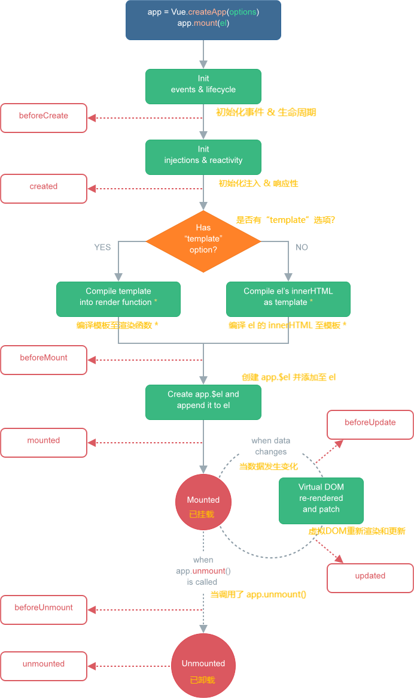

# 认识生命周期

* 每个组件都可能会经历从**创建、挂载、更新、卸载**等一系列的过程；

* 在这个过程中的**某一个阶段**，用于可能会想要**添加一些属于自己的代码逻辑**（比如组件创建完后就请求一些服务器数据）；

* 但是我们**如何可以知道目前组件正在哪一个过程**呢？Vue 给我们提供了**组件的生命周期函数**；

　　**生命周期函数：**

* 生命周期函数是**一些钩子函数**，在**某个时间会被 Vue 源码内部进行回调**；

* 通过对生命周期函数的回调，我们可以**知道目前组件正在经历什么阶段**；

* 那么我们就可以在**该生命周期中编写属于自己的逻辑代码了**；

　　

# 生命周期的流程

　　

　　

　　
