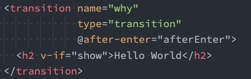

# 认识动画

　　在开发中，我们想要给一个组件的**显示和消失添加某种过渡动画**，可以很好的**增加用户体验**：

* React 框架本身并**没有提供任何动画相关的 API**，所以在 React 中使用过渡动画我们需要使用一个**第三方库**

　　**react-transition-group**；

* Vue 中为我们提供**一些内置组件和对应的 API** 来完成动画，利用它们我们可以**方便的实现过渡动画效果**；

　　我们来看一个案例：

* Hello World 的显示和隐藏；

* 通过下面的代码实现，是不会有任何动画效果的；
* 

　　没有动画的情况下，**整个内容的显示和隐藏会非常的生硬**：

* 如果我们希望给**单元素或者组件实现过渡动画**，可以**使用 transition 内置组件**来完成动画；

　　

　　

# Vue 的 transition 动画

　　**Vue 提供了 transition 的封装组件**，在下列情形中，可以给任何元素和组件添加进入/离开过渡：

* **条件渲染** (使用 v-if)条件展示 (使用 v-show)

* **动态组件**

* **组件根节点**

　　

　　

　　

## Transition 组件的原理

　　**我们会发现，Vue 自动给 h2 元素添加了动画，这是什么原因呢？**

　　**当插入或删除包含在 transition 组件中的元素时，Vue 将会做以下处理：**

1. 自动嗅探**目标元素是否应用了 CSS 过渡或者动画**，如果有，那么**在恰当的时机添加/删除 CSS 类名**；

2. 如果 transition 组件提供了 **JavaScript 钩子函数**，这些钩子函数将在恰当的时机被调用；

3. 如果**没有找到 JavaScript 钩子并且也没有检测到 CSS 过渡/动画，DOM 插入、删除操作将会立即执行；**

　　**那么都会添加或者删除哪些 class 呢？**

　　

　　

## 过渡动画 class

　　**我们会发现上面提到了很多个 class，事实上 Vue 就是帮助我们在这些 class 之间来回切换完成的动画：**

* **v-enter-from**：定义进入过渡的开始状态。在元素被插入之前生效，在元素被插入之后的下一帧移除。

* **v-enter-active**：定义进入过渡生效时的状态。在整个进入过渡的阶段中应用，在元素被插入之前生效，在过渡/动画完成之后移除。这个类可以被用来定义进入过渡的过程时间，延迟和曲线函数。

* **v-enter-to**：定义进入过渡的结束状态。在元素被插入之后下一帧生效 (与此同时 v-enter-from 被移除)，在过渡/动画完成之后移除。
* **v****-leave-from**：定义离开过渡的开始状态。在离开过渡被触发时立刻生效，下一帧被移除。
* **v-leave-active**：定义离开过渡生效时的状态。在整个离开过渡的阶段中应用，在离开过渡被触发时立刻生效，在过渡/动画完成之后移除。这个类可以被用来定义离开过渡的过程时间，延迟和曲线函数。
* **v-leave-to**：离开过渡的结束状态。在离开过渡被触发之后下一帧生效 (与此同时 v-leave-from 被删除)，在过渡/动画完成之后移除。

　　

### class 添加的时机和命名规则

　　

　　**class 的 name 命名规则如下：**

* 如果我们使用的是一个**没有 name** 的 transition，那么所有的 class 是**以 v- 作为默认前缀**；

* 如果我们**添加了一个 name 属性**，比如 <transtion name="why">，那么所有的 class 会以 why- 开头；

　　

　　

## 过渡 css 动画

　　**前面我们是通过 transition 来实现的动画效果，另外我们也可以通过 animation 来实现。**

　　

　　

　　

## 同时设置过渡和动画

　　Vue 为了**知道过渡的完成**，内部是**在监听 transitionend 或 animationend**，到底使用哪一个取决于元素应用的CSS 规则：

* 如果我们**只是使用了其中的一个**，那么 **Vue 能自动识别类型并设置监听**；

　　**但是如果我们同时使用了过渡和动画呢？**

* 并且在这个情况下可能**某一个动画执行结束时**，**另外一个动画还没有结束**；

* 在这种情况下，我们可以**设置 type 属性为 animation 或者 transition** 来明确的告知 Vue 监听的类型；

　　

　　

　　

## 显示的指定动画时间

　　我们也可以显示的来**指定过渡的时间**，**通过 duration 属性**。

　　**duration 可以设置两种类型的值：**

* **number 类型**：同时设置进入和离开的过渡时间；

* **object 类型**：分别设置进入和离开的过渡时间；
* 

　　

　　

## 过渡的模式 mode

　　**我们来看当前的动画在两个元素之间切换的时候存在的问题：**

　　

　　我们会发现 Hello World 和 你好啊，李银河是**同时存在**的：

* 这是因为默认情况下**进入和离开动画**是同时发生的；
* 如果确实我们希望达到这个的效果，那么是没有问题；

　　但是如果我们**不希望同时执行进入和离开动画**，那么我们需要设置 transition 的**过渡模式**：

* **in-out**: 新元素先进行过渡，完成之后当前元素过渡离开；

* **out-in**: 当前元素先进行过渡，完成之后新元素过渡进入；

　　

## 动态组件的切换

　　

　　

## appear 初次渲染

　　默认情况下，**首次渲染的时候是没有动画的**，如果我们**希望给他添加上去动画**，那么就可以**增加另外一个属 appear：**

　　

　　

　　

　　

# 结合第三方动画库

## animate.css （css 库）

### 认识 animate.css

　　如果我们手动一个个来编写这些动画，那么效率是比较低的，所以在开发中我们可能会引用一些[第三方库的动画库，比如 animate.css。](https://animate.style/)

　　**什么是 animate.css 呢？**

* Animate.css is a library of ready-to-use, cross-browser animations for use in your web projects. Great

　　for emphasis, home pages, sliders, and attention-guiding hints.

* **Animate.css** 是一个已经**准备好的、跨平台的动画库**为我们的 web 项目，对于强调、主页、滑动、注意力引导非常有用；

　　**如何使用 Animate 库呢**？

* 第一步：需要安装 animate.css 库；

  * `npm install animate.css --save`
  * `yarn add animate.css`
  * `pnpm install animate.css --save`

* 第二步：导入 animate.css 库的样式；

* 第三步：使用 animation 动画或者 animate 提供的类；

　　

　　

### 自定义过渡 class

　　**我们可以通过以下 attribute 来自定义过渡类名：**

* enter-from-class

* enter-active-class

* enter-to-class

* leave-from-class

* leave-active-class

* leave-to-class

　　他们的优先级高于普通的类名，这对于 **Vue 的过渡系统和其他第三方 CSS 动画库，如 Animate.css.** 结合使用十分有用

　　

　　

### animate.css 库的使用

　　**安装 animate.css：**

　　`npm install animate.css --save`

　　`yarn add animate.css`

　　`pnpm install animate.css --save`

　　**在 main.js 中导入 animate.css：**

　　`import "animate.css";`

　　**接下来在使用的时候我们有两种用法：**

* 用法一：直接使用 **animate 库中定义的 keyframes 动画**；
* 

* 用法二：直接使用 **animate 库提供给我们的类**；
* 

　　

　　

## gsap （js 库）

### 认识 gsap 库

　　某些情况下我们希望通过 **JavaScript 来实现一些动画的效果**，这个时候我们可以选择使用[ gsap 库](https://greensock.com/)来完成。

　　**什么是 gsap 呢？**

* GSAP 是 The GreenSock Animation Platform（GreenSock 动画平台）的缩写；

* 它可以通过 **JavaScript 为 CSS 属性、SVG、Canvas 等**设置动画，并且是浏览器兼容的；

　　**这个库应该如何使用呢？**

* 第一步：需要安装 gsap 库；
* 第二步：导入 gsap 库；
* 第三步：使用对应的 api 即可；

　　**我们可以先安装一下 gsap 库：**

　　`npm install gsap`

　　

### JavaScript 钩子

　　**在使用动画之前，我们先来看一下 transition 组件给我们提供的 JavaScript 钩子，这些钩子可以帮助我们监听动画执行到什么阶段了**

　　

　　当我们使用 JavaScript 来执行过渡动画时，需要**进行 done 回调**，否则它们将会被同步调用，过渡会立即完成。

　　添加 :**css="false"**，也会让 Vue 会**跳过 CSS 的检测**，除了性能略高之外，这可以避免过渡过程中 CSS 规则的影响

　　

　　

### gsap 库的使用

　　

　　

　　

### gsap 实现数字变化

　　在一些项目中，我们会见到**数字快速变化的动画效果**，这个**动画可以很容易通过 gsap 来实现**：

　　

　　

　　	

　　

　　

## 列表过渡

　　目前为止，过渡动画我们只要是**针对单个元素或者组件**的：

* 要么是**单个节点**；

* 要么是**同一时间渲染多个节点中的一个**；

　　那么如果希望渲染的是**一个列表**，并且**该列表中添加删除数据也希望有动画执行**呢？

* 这个时候我们要**使用 <transition-group> 组件**来完成；

　　**使用 <transition-group> 有如下的特点：**

* 默认情况下，它**不会渲染一个元素的包裹****器**，但是你可以**指定一个元素并以 tag attribute 进行渲染**；
* **过渡模式不可用**，因为我们不再相互切换特有的元素；
* 内部元素总是需要**提供唯一的 key attribute 值**；
* **CSS 过渡的类将会应用在内部的元素中，而不是这个组/容器本身**；

　　

　　

### 列表过渡的基本使用

　　我们来做一个案例：

* 案例是一列数字，可以**继续添加或者删除数字**；

* 在**添加和删除数字的过程中，对添加的或者移除的数字添加动画**；

　　

　　

　　

### 列表过渡的移动动画

　　在上面的案例中**虽然新增的或者删除的节点是有动画**的，但是**对于哪些其他需要移动的节点是没有动画**的：

* 我们可以通过使用一个**新增的 v-move 的 class** 来完成动画；

* 它会**在元素改变位置的过程**中应用；

* 像之前的名字一样，我们可以**通过 name 来自定义前缀**；

　　

　　

　　案例具体代码：

```js
<template>
  <div>
    <button @click="addNum">添加数字</button>
    <button @click="removeNum">删除数字</button>
    <button @click="shuffleNum">数字洗牌</button>

    <transition-group tag="p" name="why">
      <span v-for="item in numbers" :key="item" class="item">
        {{item}}
      </span>
    </transition-group>
  </div>
</template>

<script>
  import _ from 'lodash';

  export default {
    data() {
      return {
        numbers: [0, 1, 2, 3, 4, 5, 6, 7, 8, 9],
        numCounter: 10
      }
    },
    methods: {
      addNum() {
        // this.numbers.push(this.numCounter++)
        this.numbers.splice(this.randomIndex(), 0, this.numCounter++)
      },
      removeNum() {
        this.numbers.splice(this.randomIndex(), 1)
      },
      shuffleNum() {
        this.numbers = _.shuffle(this.numbers);
      },
      randomIndex() {
        return Math.floor(Math.random() * this.numbers.length)
      }
    },
  }
</script>

<style scoped>
  .item {
    margin-right: 10px;
    display: inline-block;
  }

  .why-enter-from,
  .why-leave-to {
    opacity: 0;
    transform: translateY(30px);
  }

  .why-enter-active,
  .why-leave-active {
    transition: all 1s ease;
  }

  .why-leave-active {
    position: absolute; // 让要删除的数字脱离文档流
  }

  .why-move {
    transition: transform 1s ease;
  }
</style>
```

　　

　　

### 列表的交错过渡案例

　　**我们来通过 gsap 的延迟 delay 属性，做一个交替消失的动画：**

　　

　　

```html
<template>
  <div>
    <input v-model="keyword">
    <transition-group tag="ul" name="why" :css="false"
                      @before-enter="beforeEnter"
                      @enter="enter"
                      @leave="leave">
      <li v-for="(item, index) in showNames" :key="item" :data-index="index">
        {{item}}
      </li>
    </transition-group>
  </div>
</template>
```

```js

<script>
  import gsap from 'gsap';

  export default {
    data() {
      return {
        names: ["abc", "cba", "nba", "why", "lilei", "hmm", "kobe", "james"],
        keyword: ""
      }
    },
    computed: {
      showNames() {
        return this.names.filter(item => item.indexOf(this.keyword) !== -1)
      }
    },
    methods: {
      beforeEnter(el) {
        el.style.opacity = 0;
        el.style.height = 0;
      },
      enter(el, done) {
        gsap.to(el, {
          opacity: 1,
          height: "1.5em",
          delay: el.dataset.index * 0.5,
          onComplete: done
        })
      },
      leave(el, done) {
        gsap.to(el, {
          opacity: 0,
          height: 0,
          delay: el.dataset.index * 0.5,
          onComplete: done
        })
      }
    }
  }
</script>
```
