# 概念以及 web 发展阶段

　　

## 认识前端路由

　　**路由其实是网络工程中的一个术语**：

* 在**架构一个网络**时，非常重要的两个设备就是**路由器和交换机**。
* 当然，目前在我们生活中路由器也是越来越被大家所熟知，因为我们生活中都会用到路由器：
* 事实上，**路由器**主要维护的是一个**映射表**；
* **映射表**会决定数据的流向；

　　路由的概念在软件工程中出现，最早是在后端路由中实现的，原因是 web 的发展主要经历了这样一些阶段：

* 后端路由阶段；
* 前后端分离阶段；
* 单页面富应用（SPA）；

　　

　　

　　

## 后端路由阶段

　　早期的网站开发整个 HTML 页面是由服务器来渲染的.

* 服务器直接生产渲染好对应的 HTML 页面, 返回给客户端进行展示.

　　但是, 一个网站, 这么多页面服务器如何处理呢?

* 一个页面有自己对应的网址, 也就是 URL；
* URL 会发送到服务器, 服务器会通过正则对该 URL 进行匹配, 并且最后交给一个 Controller 进行处理；
* Controller 进行各种处理, 最终生成 HTML 或者数据, 返回给前端.

　　上面的这种操作, 就是后端路由：

* 当我们页面中需要请求不同的路径内容时, 交给服务器来进行处理, 服务器渲染好整个页面, 并且将页面返回给客户端.
* 这种情况下渲染好的页面, 不需要单独加载任何的 js 和 css, 可以直接交给浏览器展示, 这样也有利于 SEO 的优化.

　　后端路由的缺点:

* 一种情况是整个页面的模块由后端人员来编写和维护的；

* 另一种情况是前端开发人员如果要开发页面, 需要通过 PHP 和 Java 等语言来编写页面代码；

* 而且通常情况下 HTML 代码和数据以及对应的逻辑会混在一起, 编写和维护都是非常糟糕的事情；

　　

　　

　　

## 前后端分离阶段

　　**前端渲染的理解：**

* 每次请求涉及到的静态资源都会从**静态资源服务器获取**，这些资源**包括 HTML+CSS+JS**，然后**在前端对这些请求回来的资源进行渲染**；
* 需要注意的是，客户端的**每一次请求**，都会**从静态资源服务器请求文件**；
* 同时可以看到，和之前的后端路由不同，这时**后端只是负责提供 API** 了；

　　**前后端分离阶段：**

* 随着 **Ajax** 的出现, 有了**前后端分离的开发模式**；
* 后端只提供 API 来返回数据，前端**通过 Ajax 获取数据**，并且可以**通过 JavaScript 将数据渲染到页面中**；
* 这样做最大的优点就是**前后端责任的清晰**，**后端专注于数据上**，**前端专注于交互和可视化**上；
* 并且当**移动端(iOS/Android)**出现后，后端不需要进行任何处理，依然使用之前的一套 API 即可；
* 目前比较少的网站采用这种模式开发（jQuery 开发模式）；

　　

　　

　　

## URL 的 hash

　　前端路由是如何做到 URL 和内容进行映射呢？监听 URL 的改变。

　　**URL 的 hash**

* URL 的 hash 也就是锚点(#), 本质上是改变 window.location 的 href 属性；
* 我们可以通过直接赋值 location.hash 来改变 href, 但是页面不发生刷新；

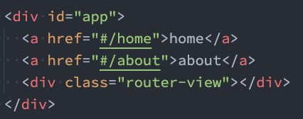

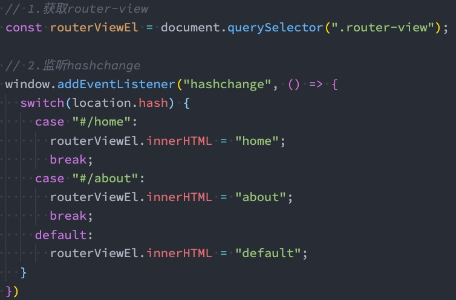

　　

　　**hash 的优势就是兼容性更好，在老版 IE 中都可以运行，但是缺陷是有一个#，显得不像一个真实的路径。**

　　

　　

　　

　　

## HTML5 的 History

　　history 接口是 HTML5 新增的, 它有 l 六种模式改变 URL 而不刷新页面：

* replaceState：替换原来的路径；
* pushState：使用新的路径；
* popState：路径的回退；
* go：向前或向后改变路径；
* forward：向前改变路径；
* back：向后改变路径；

　　

### HTML5 的 History 演练

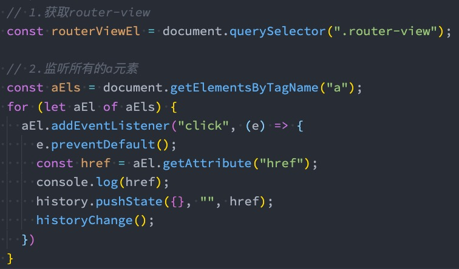

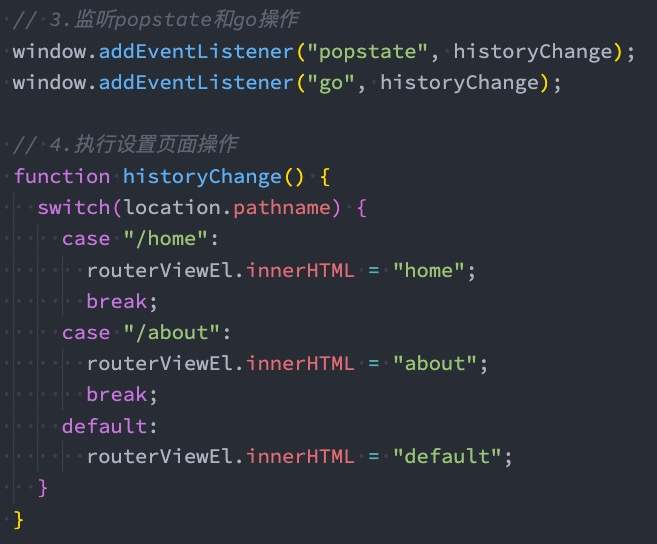

　　

　　

　　

　　

# vue-router 的使用

## 认识 vue-router

　　目前前端流行的三大框架, 都有自己的路由实现:

* Angular 的 ngRouter

* React 的 ReactRouter

* Vue 的 [vue-router](https://next.router.vuejs.org/zh/index.html)

　　[Vue Router](https://next.router.vuejs.org/zh/index.html) 是 Vue.js 的官方路由。它与 Vue.js 核心深度集成，让用 Vue.js 构建单页应用变得非常容易。

* 目前 Vue 路由最新的版本是 4.x 版本，我们上课会基于最新的版本讲解。

　　vue-router 是基于路由和组件的

* 路由用于设定访问路径, 将路径和组件映射起来.

* 在 vue-router 的单页面应用中, 页面的路径的改变就是组件的切换.

　　安装 Vue Router：

　　`npm install vue-router@4`

　　

　　

## 路由的使用步骤

　　使用 vue-router 的步骤:

* 第一步：创建路由组件的组件；

* 第二步：配置路由映射: 组件和路径映射关系的 routes 数组；
* 第三步：通过 createRouter 创建路由对象，并且传入 routes 和 history 模式；
* 第四步：使用路由: 通过 <router-link> 和 <router-view>；

router/index.js

main.js

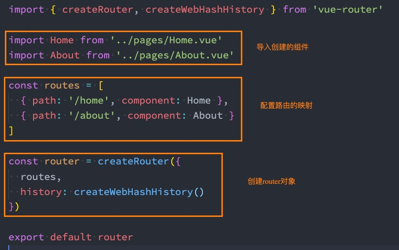

　　App.vue

　　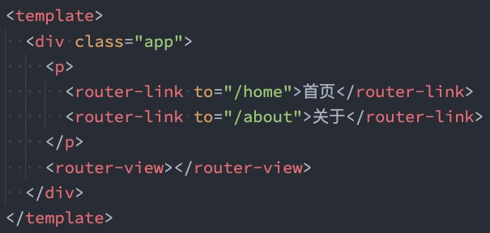

　　

　　

## 路由的默认路径

　　我们这里还有一个不太好的实现:

* 默认情况下, 进入网站的首页, 我们希望 <router-view> 渲染首页的内容；
* 但是我们的实现中, 默认没有显示首页组件, 必须让用户点击才可以；

　　如何可以让**路径默认跳到到首页**, 并且 <router-view> 渲染首页组件呢?

　　我们在 routes 中又配置了一个映射：

* path 配置的是根路径: /

* redirect 是重定向, 也就是我们将根路径重定向到/home 的路径下, 这样就可以得到我们想要的结果了

　　

　　

　　

## history 模式

　　另外一种选择的模式是 history 模式：

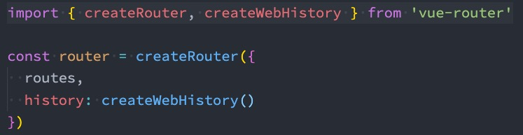

　　

　　

　　

## router-link

　　**router-link 事实上有很多属性可以配置：**

　　to 属性：

* 是一个字符串，或者是一个对象

　　replace 属性：

* 设置 replace 属性的话，当点击时，会调用 router.replace()，而不是 router.push()；

　　active-class 属性：

* 设置激活 a 元素后应用的 class，默认是 router-link-active

　　exact-active-class 属性：

* 链接精准激活时，应用于渲染的 <a> 的 class，默认是 router-link-exact-active；

　　

　　

　　

## 路由懒加载

　　当打包构建应用时，JavaScript 包会变得非常大，影响页面加载：

* 如果我们能把不同路由对应的组件分割成不同的代码块，然后当路由被访问的时候才加载对应组件，这样就会更加高效；

* 也可以提高首屏的渲染效率；

　　其实这里还是我们前面讲到过的 webpack 的分包知识，而 Vue Router 默认就支持动态来导入组件：

* 这是因为 component 可以传入一个组件，也可以接收一个函数，该函数 需要放回一个 Promise；

* 而 import 函数就是返回一个 Promise；

　　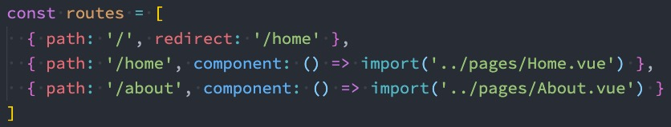

　　

　　

### 打包效果分析

　　我们看一下打包后的效果：

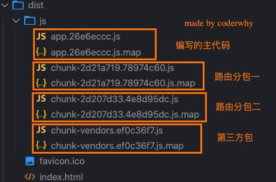

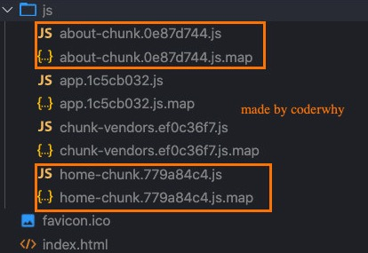

　　我们会发现分包是没有一个很明确的名称的，其实 webpack 从 3.x 开始支持对分包进行命名（chunk name）：

　　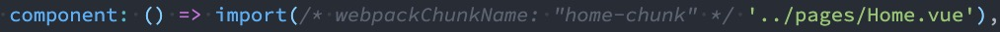

　　

　　

　　

## 路由其他属性

* name 属性：路由记录独一无二的名称
* meta 属性：自定义数据

　　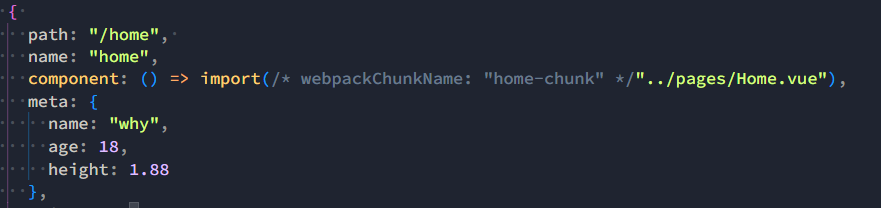

　　

　　

　　

　　

## 动态路由基本匹配

　　很多时候我们需要将给定匹配模式的路由映射到同一个组件：

* 例如，我们可能有一个 User 组件，它应该对所有用户进行渲染，但是用户的 ID 是不同的；
* 在 Vue Router 中，我们可以在路径中使用一个动态字段来实现，我们称之为 路径参数；

　　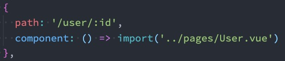

　　n 在 router-link 中进行如下跳转：

　　

　　

　　

　　

### 获取动态路由的值

　　那么在 User 中如何获取到对应的值呢？

* 在 template 中，直接通过 $route.params 获取值；

  * 在 created 中，通过 this.$route.params 获取值；
  * 在 setup 中，我们要使用 vue-router 库给我们提供的一个 hook useRoute；

    * 该 Hook 会返回一个 Route 对象，对象中保存着当前路由相关的值；

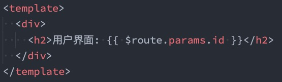

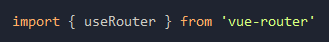

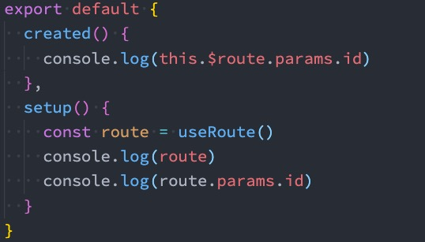

　　

　　

### 匹配多个参数

　　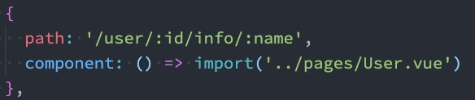

　　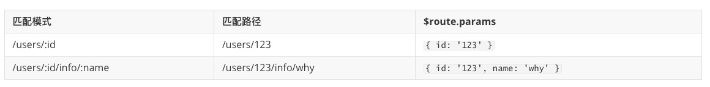

　　

### 匹配规则加*

　　这里还有另外一种写法：

* 注意：我在/:pathMatch(.*)后面又加了一个 *；

　　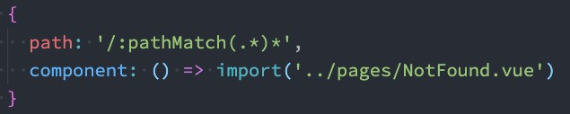

　　它们的区别在于解析的时候，是否解析 /：

　　

　　

　　

　　

　　

## NotFound

　　对于哪些没有匹配到的路由，我们通常会匹配到固定的某个页面

* 比如 NotFound 的错误页面中，这个时候我们可编写一个动态路由用于匹配所有的页面；
* 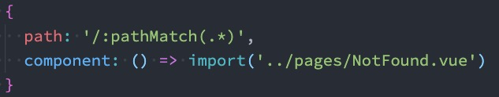

　　我们可以通过 $route.params.pathMatch 获取到传入的参数：

　　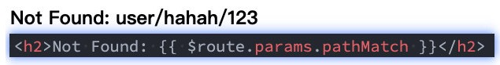

　　

　　

　　

　　

## **路由的嵌套**

　　什么是路由的嵌套呢？

* 目前我们匹配的 Home、About、User 等都属于底层路由，我们在它们之间可以来回进行切换；
* 但是呢，我们 Home 页面本身，也可能会在多个组件之间来回切换：

  * 比如 Home 中包括 Product、Message，它们可以在 Home 内部来回切换；

* 这个时候我们就需要使用嵌套路由，在 Home 中也使用 router-view 来占位之后需要渲染的组件；

　　

　　

### 路由的嵌套配置

　　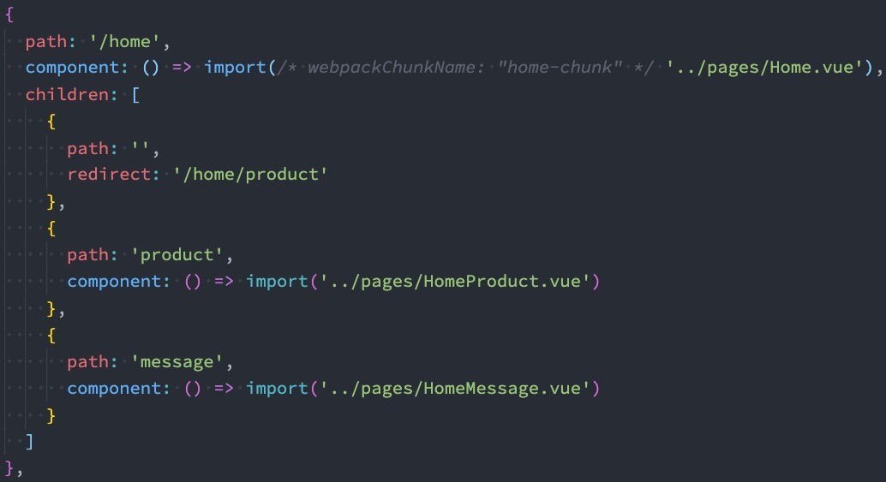

　　

　　

　　

　　

## 代码的页面跳转（编程式导航）

　　有时候我们希望通过代码来完成页面的跳转，比如点击的是一个按钮：

　　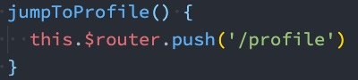

　　当然，我们也可以传入一个对象：

　　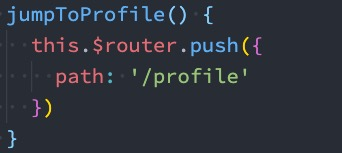

　　如果是在 setup 中编写的代码，那么我们可以通过 useRouter 来获取：

　　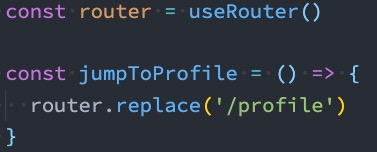

　　

　　

### query 方式的参数

　　我们也可以通过 query 的方式来传递参数：

　　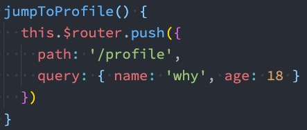

　　在界面中通过 $route.query 来获取参数：

　　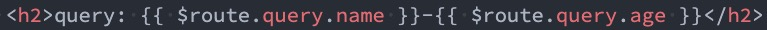

　　

　　

### 替换当前的位置

　　使用 push 的特点是压入一个新的页面，那么在用户点击返回时，上一个页面还可以回退，但是如果我们希望当前页面是一个替换操作，那么可以使用 replace：

　　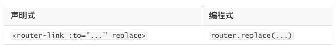

　　

　　

## 页面的前进后退

　　router 的 go 方法：

　　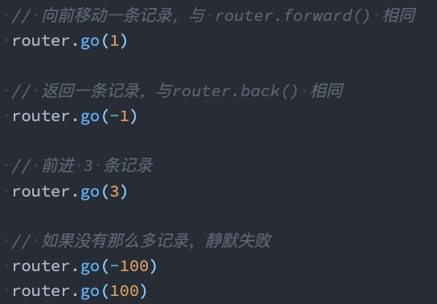

　　router 也有 back：

* 通过调用 history.back() 回溯历史。相当于 router.go(-1)；

　　router 也有 forward：

* 通过调用 history.forward() 在历史中前进。相当于 router.go(1)；

　　

　　

## router-link 的 v-slot

　　在 vue-router3.x 的时候，router-link 有一个 tag 属性，可以决定 router-link 到底渲染成什么元素：

* 但是在 vue-router4.x 开始，该属性被移除了；
* 而给我们提供了更加具有灵活性的 v-slot 的方式来定制渲染的内容；

　　**v-slot 如何使用呢？**

　　首先，我们需要使用 custom 表示我们整个元素要自定义

* 如果不写，那么自定义的内容会被包裹在一个 a 元素中；

　　其次，我们使用 v-slot 来作用域插槽来获取内部传给我们的值：

* href：解析后的 URL；
* route：解析后的规范化的 route 对象；
* navigate：触发导航的函数；
* isActive：是否匹配的状态；
* isExactActive：是否是精准匹配的状态；

　　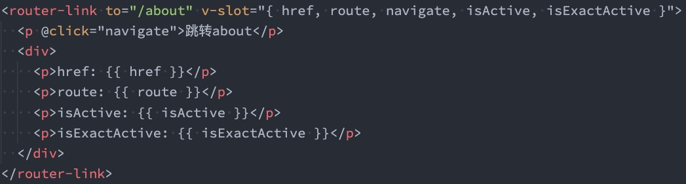

　　

　　

　　

　　

## router-view 的 v-slot

　　router-view 也提供给我们一个插槽，可以用于 <transition> 和 <keep-alive> 组件来包裹你的路由组件：

* Component：要渲染的组件；

* route：解析出的标准化路由对象；

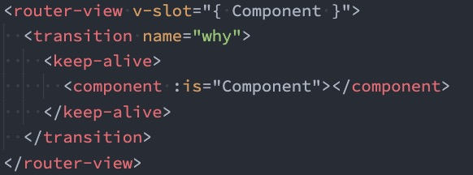

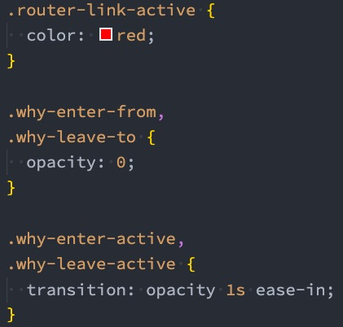

　　

　　

　　

　　

## 动态添加路由

　　某些情况下我们可能需要动态的来添加路由：

* 比如根据用户不同的权限，注册不同的路由；

* 这个时候我们可以使用一个方法 addRoute；

　　如果我们是为 route 添加一个 children 路由，那么可以传入对应的 name：

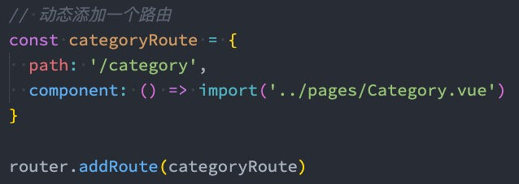

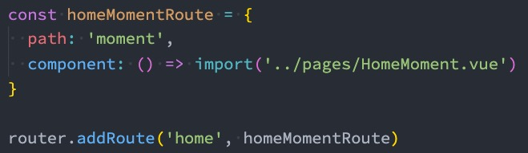

　　

　　

　　

## 动态删除路由

　　删除路由有以下三种方式：

* 方式一：添加一个 name 相同的路由；

* 方式二：通过 removeRoute 方法，传入路由的名称；

* 方式三：通过 addRoute 方法的返回值回调；

　　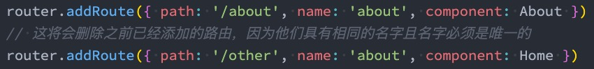

　　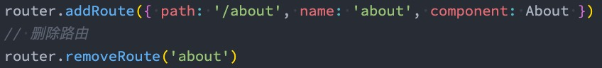

　　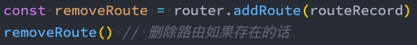

　　

　　路由的其他方法补充：

* router.hasRoute()：检查路由是否存在。

* router.getRoutes()：获取一个包含所有路由记录的数组。

　　

　　

　　

　　

# 路由导航守卫

> vue-router 提供的导航守卫主要用来通过跳转或取消的方式守卫导航。
>

　　**全局的前置守卫 beforeEach 是在导航触发时会被回调的：**

　　它有两个参数：

* to：即将进入的路由 Route 对象；

* from：即将离开的路由 Route 对象；

　　它有返回值：

* false：取消当前导航；
* 不返回或者 undefined：进行默认导航；
* 返回一个路由地址：

  * 可以是一个 string 类型的路径；
  * 可以是一个对象，对象中包含 path、query、params 等信息；

　　可选的第三个参数：next

* 在 Vue2 中我们是通过 next 函数来决定如何进行跳转的；
* 但是在 Vue3 中我们是通过返回值来控制的，不再推荐使用 next 函数，这是因为开发中很容易调用多次 next

　　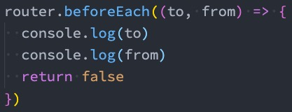

　　

　　

　　

## 登录守卫功能

　　比如我们完成一个功能，只有登录后才能看到其他页面：

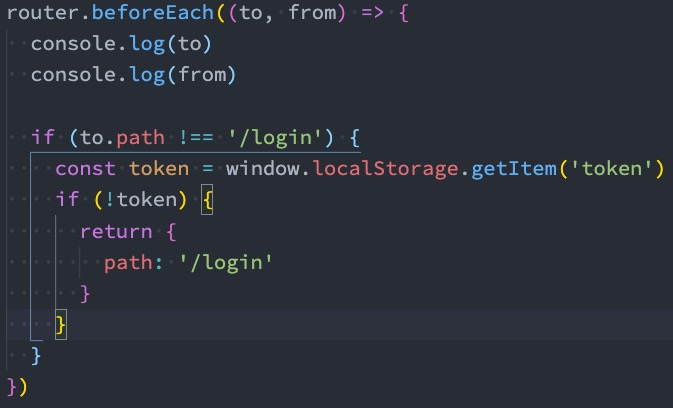

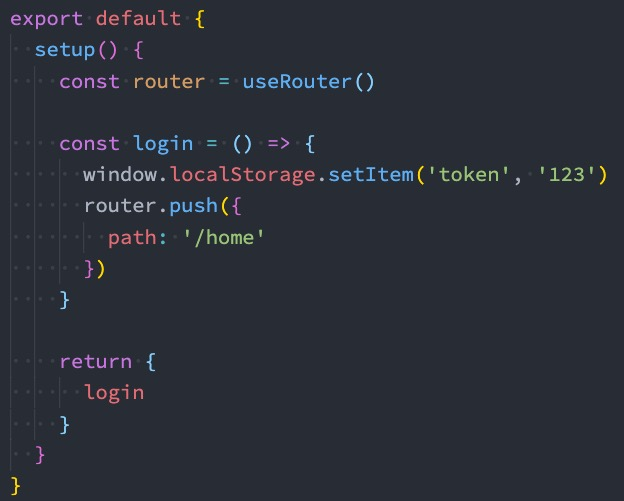

　　

　　

## 其他导航守卫

　　Vue 还提供了很多的其他守卫函数，目的都是在某一个时刻给予我们回调，让我们可以更好的控制程序的流程或者功能：[导航守卫 | Vue Router](https://next.router.vuejs.org/zh/guide/advanced/navigation-guards.html)

　　我们一起来看一下完整的导航解析流程：

* 导航被触发。
* 在失活的组件里调用 beforeRouteLeave 守卫。
* 调用全局的 beforeEach 守卫。
* 在重用的组件里调用 beforeRouteUpdate 守卫(2.2+)。
* 在路由配置里调用 beforeEnter。
* 解析异步路由组件。
* 在被激活的组件里调用 beforeRouteEnter。
* 调用全局的 beforeResolve 守卫(2.5+)。
* 导航被确认。
* 调用全局的 afterEach 钩子。
* 触发 DOM 更新。
* 调用 beforeRouteEnter 守卫中传给 next 的回调函数，创建好的组件实例会作为回调函数的参数传入。
