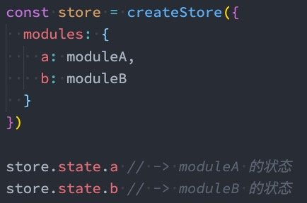

# 概论

## 什么是状态管理

　　在开发中，我们会的应用程序需要处理各种各样的数据，这些数据需要保存在我们应用程序中的某一个位置，对于这些数据的管理我们就称之为是 **状态管理**。

　　在前面我们是如何管理自己的状态呢？

* 在 Vue 开发中，我们使用组件化的开发方式；
* 而在组件中我们定义 data 或者在 setup 中返回使用的数据，

　　这些数据我们称之为 state；

* 在模块 template 中我们可以使用这些数据，模块最终会被渲染成 DOM，我们称之为 View；

* 在模块中我们会产生一些行为事件，处理这些行为事件时，有可能会修改 state，这些行为事件我们称之为 actions；

　　

　　

　　

## 复杂的状态管理

　　JavaScript 开发的应用程序，已经变得越来越复杂了：

* JavaScript 需要管理的状态越来越多，越来越复杂；
* 这些状态包括服务器返回的数据、缓存数据、用户操作产生的数据等等；
* 也包括一些 UI 的状态，比如某些元素是否被选中，是否显示加载动效，当前分页；

　　当我们的应用遇到**多个组件共享状态**时，单向数据流的简洁性很容易被破坏：

* 多个视图依赖于同一状态；
* 来自不同视图的行为需要变更同一状态；

　　我们是否可以通过组件数据的传递来完成呢？

* 对于一些简单的状态，确实可以通过 props 的传递或者 Provide 的方式来共享状态；

* 但是对于复杂的状态管理来说，显然单纯通过传递和共享的方式是不足以解决问题的，比如兄弟组件如何共享

　　数据呢？

　　

　　

　　

　　

## Vuex 的状态管理

　　管理不断变化的 state 本身是非常困难的：

* 状态之间相互会存在依赖，一个状态的变化会引起另一个状态的变化，View 页面也有可能会引起状态的变化；
* 当应用程序复杂时，state 在什么时候，因为什么原因而发生了变化，发生了怎么样的变化，会变得非常难以控制和追踪；

　　因此，我们是否可以考虑将组件的内部状态抽离出来，以一个全局单例的方式来管理呢？

* 在这种模式下，我们的组件树构成了一个巨大的 “试图 View”；
* 不管在树的哪个位置，任何组件都能获取状态或者触发行为；
* 通过定义和隔离状态管理中的各个概念，并通过强制性的规则来维护视图和状态间的独立性，我们的代码边会变得更加结构化和易于维护、跟踪；

　　这就是 Vuex 背后的基本思想，它借鉴了 Flux、Redux、Elm（纯函数语言，redux 有借鉴它的思想）：

　　

　　

　　

　　

### Vuex 的安装

　　依然我们要使用 vuex，首先第一步需要安装 vuex：

* 我们这里使用的是 vuex4.x，安装的时候需要添加 next 指定版本；

　　`npm install vuex@next`

　　

　　

# Store

## 创建 Store

　　每一个 Vuex 应用的核心就是 store（仓库）：

* store 本质上是一个容器，它包含着你的应用中大部分的状态（state）；

　　**Vuex 和单纯的全局对象有什么区别呢？**

　　第一：Vuex 的状态存储是响应式的

* 当 Vue 组件从 store 中读取状态的时候，若 store 中的状态发生变化，那么相应的组件也会被更新；

　　第二：你不能直接改变 store 中的状态

* 改变 store 中的状态的唯一途径就显示**提交 (commit) mutation**；
* 这样使得我们可以方便的跟踪每一个状态的变化，从而让我们能够通过一些工具帮助我们更好的管理应用的状态；

　　使用步骤：

* 创建 Store 对象；
* 在 app 中通过插件安装；

　　

　　

## 组件中使用 Store

　　在组件中使用 store，我们按照如下的方式：

* 在模板中使用；
* 在 options api 中使用，比如 computed；
* 在 setup 中使用；

　　

　　

　　

　　

## 单一状态树

　　Vuex 使用单一状态树：

* 用一个对象就包含了全部的应用层级状；
* 采用的是 SSOT，Single Source of Truth，也可以翻译成单一数据源；
* 这也意味着，每个应用将仅仅包含一个 store 实例；
* 单状态树和模块化并不冲突，后面我们会讲到 module 的概念；

　　单一状态树的优势：

* 如果你的状态信息是保存到多个 Store 对象中的，那么之后的管理和维护等等都会变得特别困难；
* 所以 Vuex 也使用了单一状态树来管理应用层级的全部状态；
* 单一状态树能够让我们最直接的方式找到某个状态的片段，而且在之后的维护和调试过程中，也可以非常方便的管理和维护；

　　

　　

　　

## 组件获取状态

　　在前面我们已经学习过如何在组件中获取状态了。

　　当然，如果觉得那种方式有点繁琐（表达式过长），我们可以使用计算属性：

　　

　　但是，如果我们有很多个状态都需要获取的话，可以使用 **mapState 的辅助函数**：

* mapState 的方式一：对象类型；
* mapState 的方式二：数组类型；
* 也可以使用展开运算符和来原有的 computed 混合在一起；

　　

　　对象写法

　　

　　

　　

　　

## 在 setup 中使用 mapState

　　在 setup 中如果我们单个获取装是非常简单的：

* 通过 useStore 拿到 store 后去获取某个状态即可；
* 但是如果我们需要使用 mapState 的功能呢？

　　默认情况下，Vuex 并没有提供非常方便的使用 mapState 的方式，这里我们进行了一个函数的封装->["useState 封装"](siyuan://blocks/20211206140721-umkmczn)：

　　

　　

传统方式

　　

　　

　　

　　

# getters

## getters 的基本使用

　　某些属性我们可能需要经常变化后来使用，这个时候可以使用 getters：

　　

　　

　　

## getters 第二个参数

　　getters 可以接收第二个参数：

　　

　　

　　

## getters 的返回函数

　　getters 中的函数本身，可以返回一个函数，那么在使用的地方相当于可以调用这个函数：

　　

　　

　　

## mapGetters 的辅助函数

　　这里我们也可以使用 mapGetters 的辅助函数。

　　

　　

　　在 setup 中使用 -> ["useGetters 封装"](siyuan://blocks/20211206150011-ai0hehg)

　　

　　

　　

　　

　　

　　

# Mutation

## Mutation 基本使用

　　更改 Vuex 的 store 中的状态的**唯一方法**是**提交 mutation**：

　　

　　

　　

## Mutation 携带数据

　　很多时候我们在提交 mutation 的时候，会携带一些数据，这个时候我们可以使用参数：

　　

　　payload 为对象类型

　　

　　对象风格的提交方式

　　

　　

　　

## Mutation 常量类型

　　定义常量：mutation-type.js

　　

　　定义 mutation

　　

　　提交 mutation

　　

　　

　　

　　

## mapMutations 辅助函数

　　我们也可以借助于辅助函数，帮助我们快速映射到对应的方法中：

　　

　　在 setup 中使用也是一样的：

　　

　　

　　

## mutation 重要原则

　　一条重要的原则就是要记住 **mutation 必须是同步函数**

* 这是因为 devtool 工具会记录 mutation 的日记；
* 每一条 mutation 被记录，devtools 都需要捕捉到前一状态和后一状态的快照；
* 但是在 mutation 中执行异步操作，就无法追踪到数据的变化；
* 所以 Vuex 的重要原则中要求 mutation 必须是同步函数；

　　

　　

　　

　　

# actions

## actions 的基本使用

　　Action 类似于 mutation，不同在于：

* Action **提交的是 mutation**，而**不是直接变更状态**；

* Action **可以包含任意异步操作**；

　　

　　

　　这里有一个非常重要的参数 context：

* context 是一个和 store 实例均有相同方法和属性的 context 对象；
* 所以我们可以从其中获取到 commit 方法来提交一个 mutation，或者通过 context.state 和 context.getters 来获取 state 和 getters；
* 但是为什么它不是 store 对象呢？这个等到我们讲 Modules 时再具体来说；

　　

　　

## actions 的分发操作

　　如何使用 action 呢？进行 action 的分发：

* 分发使用的是 store 上的 **dispatch 函数**；
* 

　　同样的，它也可以携带我们的参数：

　　

　　也可以以对象的形式进行分发：

　　

　　

　　

　　

　　

## actions 的辅助函数

　　action 也有对应的辅助函数：

* 对象类型的写法；
* 数组类型的写法；

　　

　　

　　

## actions 的异步操作

　　Action 通常是异步的，那么如何知道 action 什么时候结束呢？

* 我们可以通过让 action 返回 Promise，在 Promise 的 then 中来处理完成后的操作；

　　

　　

　　

　　

　　

　　

# module

## module 的基本使用

　　什么是 Module？

* 由于使用单一状态树，应用的所有状态会集中到一个比较大的对象，当应用变得非常复杂时，store 对象就有可能变得相当臃肿；
* 为了解决以上问题，Vuex 允许我们将 store 分割成**模块（module）**；
* 每个模块拥有自己的 state、mutation、action、getter、甚至是嵌套子模块；

　　

　　

## module 的局部状态

　　对于模块内部的 mutation 和 getter，接收的第一个参数是**模块的局部状态对象：**

　　

　　

　　

　　

　　

## module 的命名空间

　　默认情况下，模块内部的 action 和 mutation 仍然是注册在**全局的命名空间**中的：

* 这样使得多个模块能够对同一个 action 或 mutation 作出响应；
* Getter 同样也默认注册在全局命名空间；

　　如果我们希望模块具有更高的封装度和复用性，可以添加 **namespaced: true** 的方式使其成为带命名空间的模块：

* 当模块被注册后，它的所有 getter、action 及 mutation 都会自动根据模块注册的路径调整命名；

　　

　　

　　

　　

## module 修改或派发根组件

　　如果我们希望在 action 中修改 root 中的 state，那么有如下的方式：

　　

　　

　　

　　

　　

## module 的辅助函数

　　module 辅助函数有三种使用方法：

* 方式一：通过完整的模块空间名称来查找；
* 
* 方式二：第一个参数传入模块空间名称，后面写上要使用的属性；
* 
* **方式三**：通过 vuex的 createNamespacedHelpers 生成一个模块的辅助函数；
* 

　　

　　

　　
