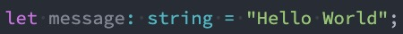
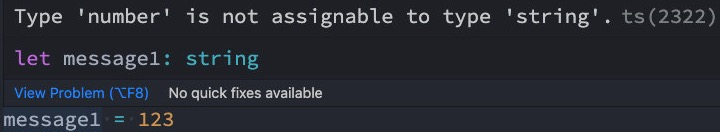
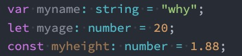
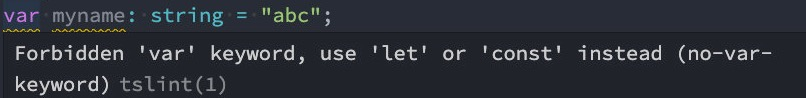
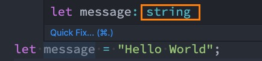
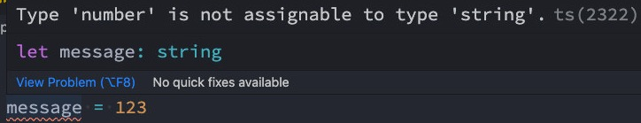
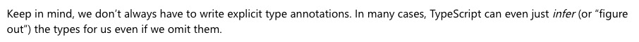

# 变量

## 变量的声明

　　在 TypeScript 中定义变量需要指定 **标识符** 的类型。

　　所以完整的声明格式如下：

* 声明了类型后 TypeScript 就会进行**类型检测**，声明的类型可以称之为**类型注解**；
* **var/let/const 标识符: 数据类型 = 赋值;**

　　比如我们声明一个 message，完整的写法如下：

* 注意：这里的 string 是**小写**的，和 String 是有区别的
* string 是 TypeScript 中定义的字符串类型，String 是 ECMAScript 中定义的一个类
* 

　　如果我们给 message 赋值其他类型的值，那么就会报错：

　　

　　

　　

　　

## 声明变量的关键字

　　在 TypeScript 定义变量（标识符）和 ES6 之后一致，可以使用 var、let、const 来定义。

　　

　　当然，在 tslint 中并不推荐使用 var 来声明变量：

* 可见，在 TypeScript 中并不建议再使用 var 关键字了，主要原因和 ES6 升级后 let 和 var 的区别是一样的，var 是没有块级作用域的，会引起很多的问题，这里不再展开探讨。

　　

　　

　　

　　

## 变量的类型推导（推断）

　　在开发中，有时候为了方便起见我们并不会在声明每一个变量时都写上对应的数据类型，我们更希望可以通过TypeScript 本身的特性帮助我们推断出对应的变量类型：

　　

　　	如果我们给 message 赋值 123：

　　

　　	这是因为在一个变量第一次赋值时，会根据后面的赋值内容的类型，来推断出变量的类型：

* 上面的 message 就是因为后面赋值的是一个 string 类型，所以 message 虽然没有明确的说明，但是依然是一个 string 类型；

　　

　　

　　

　　

　　

　　

　　

　　

　　
