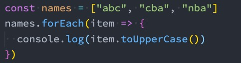
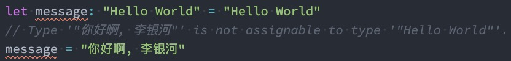
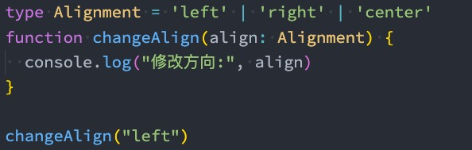
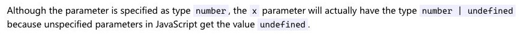

## JavaScript 类型 – number 类型

　　数字类型是我们开发中经常使用的类型，TypeScript 和 JavaScript 一样，不区分整数类型（int）和浮点型（double），统一为 number 类型。

　　

　　如果你学习过 ES6 应该知道，ES6 新增了二进制和八进制的表示方法，而 TypeScript 也是支持二进制、八进制、十六进制的表示：

　　

　　

　　

## JavaScript 类型 – boolean 类型

　　boolean 类型只有两个取值：true 和 false，非常简单

　　

　　

　　

## JavaScript 类型 – string 类型

　　string 类型是字符串类型，可以使用单引号或者双引号表示：

　　

　　同时也支持 ES6 的模板字符串来拼接变量和字符串：

　　

　　

　　

## JavaScript 类型 – Array 类型

　　数组类型的定义也非常简单，有两种方式：推荐 `names:string[]`

　　

　　如果添加其他类型到数组中，那么会报错：

　　

　　

　　

　　

## JavaScript 类型 – Object 类型

　　object 对象类型可以用于描述一个对象：

　　

　　但是从 myinfo 中我们不能获取数据，也不能设置数据：

　　

　　

　　所有，直接使用类型推导即可

　　

　　

　　

　　

## JavaScript 类型 – null 和 undefined 类型

　　在 JavaScript 中，undefined 和 null 是两个基本数据类型。

　　在 TypeScript 中，它们各自的类型也是 undefined 和 null，也就意味着它们既是实际的值，也是自己的类型：

　　

　　

　　

　　

## JavaScript 类型 – Symbol 类型

　　在 ES5 中，如果我们是不可以在对象中添加相同的属性名称的，比如下面的做法：

　　

　　通常我们的做法是定义两个不同的属性名字：比如 identity1 和 identity2。

　　但是我们也可以通过 symbol 来定义相同的名称，因为 Symbol 函数返回的是不同的值：

　　

　　

　　

　　

　　

　　

　　

## TypeScript 类型 - any 类型

　　在某些情况下，我们确实无法确定一个变量的类型，并且可能它会发生一些变化，这个时候我们可以使用 any 类型（类似于 Dart 语言中的 dynamic 类型）。

　　any 类型有点像一种讨巧的 TypeScript 手段：

* 我们可以对 any 类型的变量进行任何的操作，包括获取不存在的属性、方法；
* 我们给一个 any 类型的变量赋值任何的值，比如数字、字符串的值；
* 

　　如果对于某些情况的处理过于繁琐不希望添加规定的类型注解，或者在引入一些第三方库时，缺失了类型注解，这个时候

　　我们可以使用 any：

* 包括在 Vue 源码中，也会使用到 any 来进行某些类型的适配；

　　

　　

## TypeScript 类型 - unknown 类型

　　unknown 是 TypeScript 中比较特殊的一种类型，它用于描述类型不确定的变量。

　　什么意思呢？我们来看下面的场景：

　　

　　

　　

## TypeScript 类型 - void 类型

　　void 通常用来指定一个函数是没有返回值的，那么它的返回值就是 void 类型：

* 我们可以将 null 和 undefined 赋值给 void 类型，也就是函数可以返回 null 或者 undefined
* 

　　这个函数我们没有写任何类型，那么它默认返回值的类型就是 void 的，我们也可以显示的来指定返回值是 void：

　　

　　

　　

## TypeScript 类型 - never 类型

　　never 表示永远不会发生值的类型，比如一个函数：

* 如果一个函数中是一个死循环或者抛出一个异常，那么这个函数会返回东西吗？
* 不会，那么写 void 类型或者其他类型作为返回值类型都不合适，我们就可以使用 never 类型；

　　never 有什么样的应用场景呢？这里我们举一个例子，但是它用到了联合类型，后面我们会讲到：

　　

　　

　　

　　

　　

## TypeScript 类型 - tuple 类型

　　tuple 是元组类型，很多语言中也有这种数据类型，比如 Python、Swift 等。

　　

　　那么 tuple 和数组有什么区别呢？

* 首先，数组中通常建议存放相同类型的元素，不同类型的元素是不推荐放在数组中。（可以放在对象或者元组中）
* 其次，元组中每个元素都有自己特性的类型，根据索引值获取到的值可以确定对应的类型；

　　

　　

　　

### Tuple 的应用场景

　　那么 tuple 在什么地方使用的是最多的呢？

* tuple 通常可以作为返回的值，在使用的时候会非常的方便；
* 

　　

　　

　　

　　

## 函数的参数类型

　　函数是 JavaScript 非常重要的组成部分，TypeScript 允许我们指定函数的参数和返回值的类型。

　　**参数的类型注解**

* 声明函数时，可以在每个参数后添加类型注解，以声明函数接受的参数类型：

　　

　　

　　

## 函数的返回值类型

　　我们也可以添加返回值的类型注解，这个注解出现在函数列表的后面：

　　

　　和变量的类型注解一样，我们通常情况下不需要返回类型注解，因为 TypeScript 会根据 return 返回值推断函数的返回类型：

* 某些第三方库处于方便理解，会明确指定返回类型，但是这个看个人喜好；

　　

　　

　　

## 匿名函数的参数

　　匿名函数与函数声明会有一些不同：

* 当一个函数出现在 TypeScript 可以确定该函数会被如何调用的地方时；

* 该函数的参数会自动指定类型；

　　

　　我们并没有指定 item 的类型，但是 item 是一个 string 类型：

* 这是因为 TypeScript 会根据 forEach 函数的类型以及数组的类型推断出 item 的类型；

* 这个过程称之为**上下文类型（contextual typing）**，因为函数执行的上下文可以帮助确定参数和返回值的类型；

　　

　　

## 对象类型

　　如果我们希望限定一个函数接受的参数是一个对象，这个时候要如何限定呢？

* 我们可以使用对象类型；

　　

　　在这里我们使用了一个对象来作为类型：

* 在对象我们可以添加属性，并且告知 TypeScript 该属性需要是什么类型；

* 属性之间可以使用 , 或者 ; 来分割，最后一个分隔符是可选的；
* 每个属性的类型部分也是可选的，如果不指定，那么就是 any 类型；

　　

　　

　　

## 可选类型

　　对象类型也可以指定哪些属性是可选的，可以在属性的后面添加一个**?：**

　　

　　

　　

### 可选类型补充

　　其实上，可选类型可以看做是 类型 和 undefined 的联合类型：

　　

　　

## 联合类型

　　TypeScript 的类型系统允许我们使用多种运算符，从现有类型中构建新类型。

　　我们来使用第一种组合类型的方法：联合类型（Union Type）

* 联合类型是由两个或者多个其他类型组成的类型；
* 表示可以是这些类型中的任何一个值；
* 联合类型中的每一个类型被称之为联合成员（union's members）；

　　

　　

　　

### 使用联合类型

　　传入给一个联合类型的值是非常简单的：只要保证是联合类型中的某一个类型的值即可

* 但是我们拿到这个值之后，我们应该如何使用它呢？因为它可能是任何一种类型。
* 比如我们拿到的值可能是 string 或者 number，我们就不能对其调用 string 上的一些方法；

　　那么我们怎么处理这样的问题呢？

* 我们需要使用缩小（narrow）联合（后续我们还会专门讲解缩小相关的功能）
* TypeScript 可以根据我们缩小的代码结构，推断出更加具体的类型；

　　

　　

　　

　　

　　

## 类型别名

　　在前面，我们通过在类型注解中编写 对象类型 和 联合类型，但是当我们想要多次在其他地方使用时，就要编写多次。

　　比如我们可以给对象类型起一个别名：

　　

　　

　　

　　

## 类型断言 as

　　有时候 TypeScript 无法获取具体的类型信息，这个我们需要使用类型断言（Type Assertions）。

* 比如我们通过 document.getElementById，TypeScript 只知道该函数会返回 HTMLElement ，但并不知道它具体的类型：

　　

　　

　　TypeScript 只允许类型断言转换为 更具体 或者 不太具体 的类型版本，此规则可防止不可能的强制转换：

　　

　　

　　

　　

## 非空类型断言 !

　　当我们编写下面的代码时，在执行 ts 的编译阶段会报错：

* 这是因为传入的 message 有可能是为 undefined 的，这个时候是不能执行方法的；

　　

　　但是，我们确定传入的参数是有值的，这个时候我们可以使用非空类型断言：

* 非空断言使用的是 ! ，表示可以确定某个标识符是有值的，跳过 ts 在编译阶段对它的检测；

　　

　　

　　

　　

　　

　　

## 可选链的使用

　　可选链事实上并不是 TypeScript 独有的特性，它是 ES11（ES2020）中增加的特性：

* 可选链使用可选链操作符 ?.；

* 它的作用是当对象的属性不存在时，会短路，直接返回 undefined，如果存在，那么才会继续执行；

* 虽然可选链操作是 ECMAScript 提出的特性，但是和 TypeScript 一起使用更般配；

　　

　　

　　

　　

　　

## ??和!!的作用

　　有时候我们还会看到 !! 和 ?? 操作符，这些都是做什么的呢？

　　**!!操作符：**

* 将一个其他类型转换成 boolean 类型；
* 类似于 Boolean(变量)的方式；

　　**??操作符：**

* 它是 ES11 增加的新特性；
* 空值合并操作符（??）是一个逻辑操作符，当操作符的左侧是 null 或者 undefined 时，返回其右侧操作数，否则返回左侧操作数；

　　

　　

　　

　　

## 字面量类型

　　除了前面我们所讲过的类型之外，也可以使用字面量类型（literal types）：

　　

　　那么这样做有什么意义呢？

* 默认情况下这么做是没有太大的意义的，但是我们可以将多个类型联合在一起；

　　

　　

　　

### 字面量推理

　　我们来看下面的代码：

　　

　　这是因为我们的对象再进行字面量推理的时候，info 其实是一个 {url: string, method: string}，所以我们没办法将一个 string 赋值给一个 字面量 类型

　　

　　

　　

## 类型缩小

　　什么是类型缩小呢？

* 类型缩小的英文是 Type Narrowing；
* 我们可以通过类似于 typeof padding === "number" 的判断语句，来改变 TypeScript 的执行路径；
* 在给定的执行路径中，我们可以缩小比声明时更小的类型，这个过程称之为 缩小;
* 而我们编写的 typeof padding === "number" 可以称之为 类型保护（type guards）；

　　常见的类型保护有如下几种：

* typeof
* 平等缩小（比如===、!==）
* instanceof
* in
* 等等...

　　

　　

　　

### typeof

　　在 TypeScript 中，检查返回的值 typeof 是一种类型保护：因为 TypeScript 对如何 typeof 操作不同的值进行编码。

　　

　　

　　

### 平等缩小

　　我们可以使用 Switch 或者相等的一些运算符来表达相等性（比如===, !==, ==, and != ）：

　　

　　

　　

### instanceof

　　JavaScript 有一个运算符来检查一个值是否是另一个值的“实例”：

　　

　　

　　

　　

### in

　　Javascript 有一个运算符，用于确定对象是否具有带名称的属性：in 运算符

* 如果指定的属性在指定的对象或其原型链中，则 in 运算符返回 true；

　　

　　

　　

　　

　　

## TypeScript-函数类型

　　在 JavaScript 开发中，函数是重要的组成部分，并且函数可以作为一等公民（可以作为参数，也可以作为返回值进行传递）。

　　那么在使用函数的过程中，函数是否也可以有自己的类型呢？

* 我们可以编写函数类型的表达式（Function Type Expressions），来表示函数类型；
* 

　　

　　

### TypeScript 函数类型解析

　　在上面的语法中 (num1: number, num2: number) => void，代表的就是一个函数类型：

* 接收两个参数的函数：num1 和 num2，并且都是 number 类型；

* 并且这个函数是没有返回值的，所以是 void；

　　在某些语言中，可能参数名称 num1 和 num2 是可以省略，但是 TypeScript 是不可以的：

　　

　　

　　

　　

### 参数的可选类型

　　我们可以指定某个参数是可选的：

　　

　　这个时候这个参数 x 依然是有类型的，它是什么类型呢？ number | undefined

　　

　　另外可选类型需要在必传参数的后面：

　　

　　

　　

### 默认参数

　　从 ES6 开始，JavaScript 是支持默认参数的，TypeScript 也是支持默认参数的：

　　

　　这个时候 y 的类型其实是 undefined 和 number 类型的联合

　　

　　

　　

### 剩余参数

　　从 ES6 开始，JavaScript 也支持剩余参数，剩余参数语法允许我们将一个不定数量的参数放到一个数组中

　　

　　

　　

### 可推导的 this 类型

　　this 是 JavaScript 中一个比较难以理解和把握的知识点：

* coderwhy 在公众号也有一篇文章专门讲解 this：[https://mp.weixin.qq.com/s/hYm0JgBI25grNG_2sCRlTA](https://mp.weixin.qq.com/s/hYm0JgBI25grNG_2sCRlTA)；

* 因为 this 在不同的情况下会绑定不同的值，所以对于它的类型就更难把握了；

　　那么，TypeScript 是如何处理 this 呢？我们先来看一个例子：

　　

　　上面的代码是可以正常运行的，也就是 TypeScript 在编译时，认为我们的 this 是可以正确去使用的：

* TypeScript 认为函数 sayHello 有一个对应的 this 的外部对象 info，所以在使用时，就会把 this 当做该对象。

　　

　　

### 不确定的 this 类型

　　但是对于某些情况来说，我们并不知道 this 到底是什么？

　　

　　这段代码运行会报错的：

* 这里我们再次强调一下，TypeScript 进行类型检测的目的是让我们的代码更加的安全；

* 所以这里对于 sayHello 的调用来说，我们虽然将其放到了 info 中，通过 info 去调用，this 依然是指向 info 对象的；

* 但是对于 TypeScript 编译器来说，这个代码是非常不安全的，因为我们也有可能直接调用函数，或者通过别的对象来调用函数；

　　

　　

### 指定 this 的类型

　　这个时候，通常 TypeScript 会要求我们明确的指定 this 的类型：

　　

　　

　　

　　

## 函数的重载

　　在 TypeScript 中，如果我们编写了一个 add 函数，希望可以对字符串和数字类型进行相加，应该如何编写呢？

　　我们可能会这样来编写，但是其实是错误的：

　　

　　

　　那么这个代码应该如何去编写呢？

* 在 TypeScript 中，我们可以去编写不同的重载签名（overload signatures）来表示函数可以以不同的方式进行调用；

* 一般是编写两个或者以上的重载签名，再去编写一个通用的函数以及实现；

　　

### sum 函数的重载

　　比如我们对 sum 函数进行重构：

* 在我们调用 sum 的时候，它会根据我们传入的参数类型来决定执行函数体时，到底执行哪一个函数的重载签名；

　　

　　但是注意，有实现体的函数，是不能直接被调用的：

　　

　　

　　

### 联合类型和重载

　　我们现在有一个需求：定义一个函数，可以传入字符串或者数组，获取它们的长度。

　　这里有两种实现方案：

* 方案一：使用联合类型来实现；

* 方案二：实现函数重载来实现；

　　

　　

　　在开发中我们选择使用哪一种呢？

* 在可能的情况下，尽量选择使用联合类型来实现；
