当我们提交代码到 GitHub 后，可以在 Jenkins 上执行构建，但是每次都要动手去执行略显麻烦，今天我们就来实战 Jenkins 的自动构建功能，每次提交代码到 GitHub 后，Jenkins 会进行自动构建；

　　

# 前期准备工作

　　  
进行本章的实战前，推荐您参照[《docker 下的 Jenkins 安装和体验》](https://blog.csdn.net/boling_cavalry/article/details/78942408)做安装和体验的实战，以便对 Jenkins 服务有初步了解；

## 重要前提

　　GitHub 收到提交的代码后要主动通知 Jenkins，所以 Jenkins 所在服务器一定要有外网 IP，否则 GitHub 无法访问，我的 Jenkins 服务器是部署在腾讯云的云主机上，带有外网 IP；  
本次实战要提交源码到 GitHub，所以您需要有一个 GitHub 号，并在上面创建工程；  
 

## 实战步骤梳理

　　  
本次整个实战过程依次为如下步骤：

1. GitHub 上准备一个要自动部署的项目；
2. GitHub 上配置 Jenkins 的 webhook 地址；
3. 在 GitHub 上创建一个 access token，Jenkins 做一些需要权限的操作的时候就用这个 access token 去鉴权
4. Jenkins 安装 GitHub Plugin 插件；
5. Jenkins 配置 GitHub 访问权限；
6. Jenkins 上创建一个构建项目，对应的源码是步骤 1 中的 web 工程；
7. 修改 web 工程的源码，并提交到 GitHub 上；
8. 检查 Jenkins 的构建项目是否被触发自动构建，构建成功后，下载工程运行，看是不是基于最新的代码构建的；  

    ### webhook 地址

    webhook 是通知 Jenkins 时的请求地址，用来填写到 GitHub 上，这样 GitHub 就能通过该地址通知到 Jenkins；  
    假设 Jenkins 所在服务器的地址是：119.91.251.182，端口为 8080，那么 webhook 地址就是 http://119.91.251.182:8080/github-webhook

　　再次提醒，上述地址必须是外网也能访问的，否则 GitHub 无法访问到 Jenkins；

　　

## 配置 GitHub

　　  
登录 GitHub，进入要本次构建用到的工程；  
在工程主页面点击右上角的"Settings"，再点击左侧"Webhooks"，然后点击“Add webhook”，如下图：

　　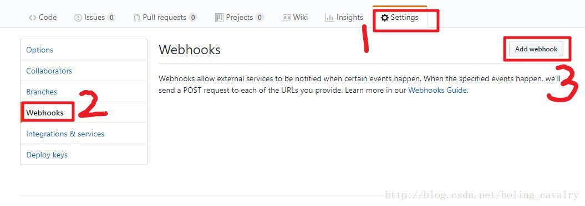

　　如下图，在"Payload URL"位置填入 webhook 地址，再点击底部的"Add webhook 按钮"，这样就完成 webhook 配置了，今后当前工程有代码提交，GitHub 就会向此 webhook 地址发请求，通知 Jenkins 构建：

　　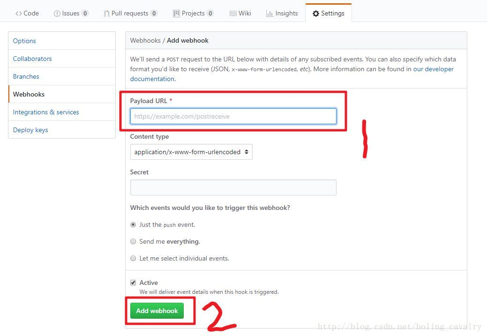

　　

### 生成 Personal access tokens

　　  
Jenkins 访问 GitHub 工程的时候，有的操作是需要授权的，所以我们要在 GitHub 上生成授权的 token 给 Jenkins 使用，这就是 Personal access tokens，生成步骤如下：

　　登录 GitHub，进入"Settings"页面，点击左下角的"Developer settings"，如下图：

　　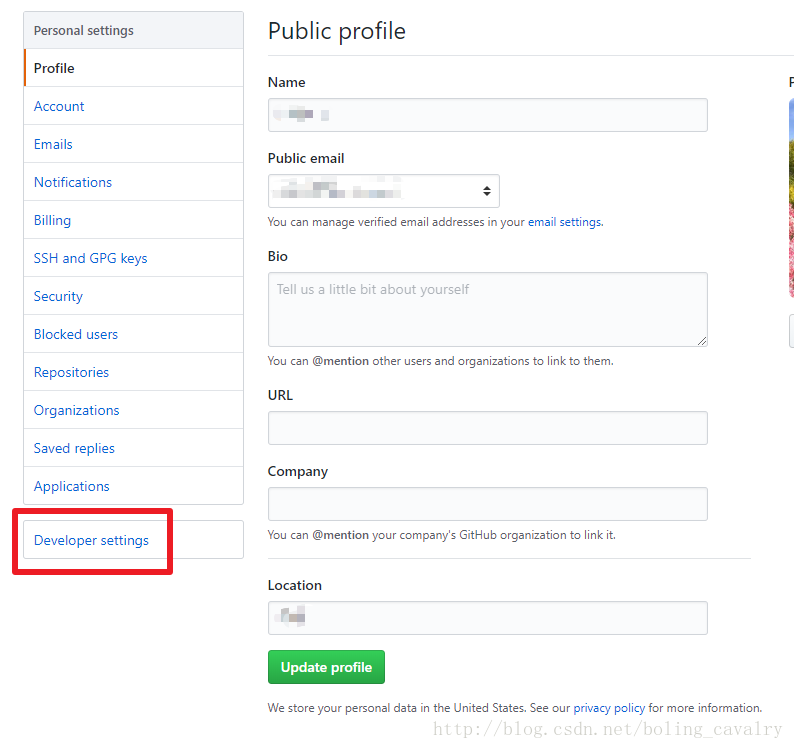

　　跳转到"Developer settings"页面后，点击左下角的“Personal access tokens”，如下图：

　　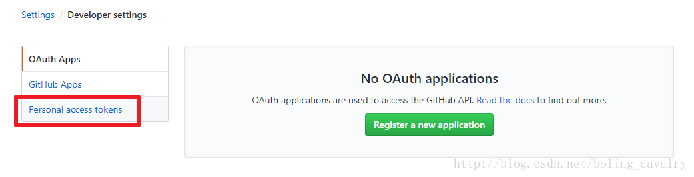

　　跳转到"Personal access tokens"页面后，点击右上角的"Generate new token"按钮，如下图：

　　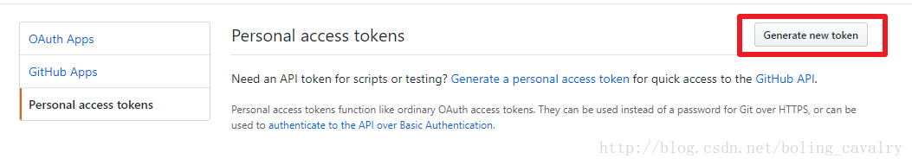

　　可能会提示输入 GitHub 密码，输入后跳转到创建 token 的页面，如下图所示，输入 title，再勾选"repo"和"admin:repo_hook"，再点击底部的"Generate token"按钮，就能产生一个新的 access token，将此字符串复制下来，后面 jenkins 任务中会用到：

　　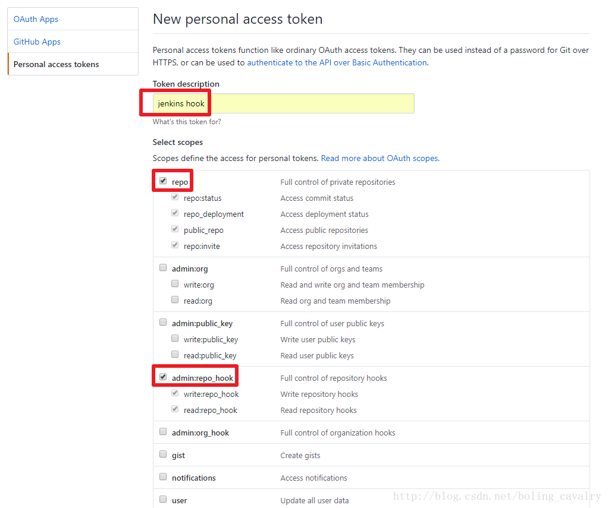

　　Jenkins 配置  
GitHub Plugin 插件，在"系统管理-> 管理插件"位置检查此插件是否已经安装，没有的话请先安装；  
配置 GitHub，点击“系统管理-> 系统设置”，如下图：

　　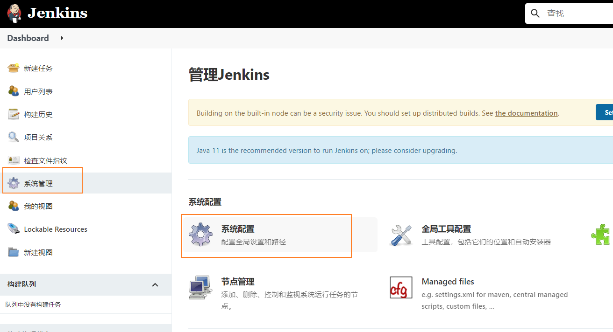

　　在系统设置页面找到"GitHub"，配置一个"GitHub Server"，如下图，“API URL"填写"https://api.github.com”，“Credentials"位置如下图红框所示，选择"Add->Jenkins”：

　　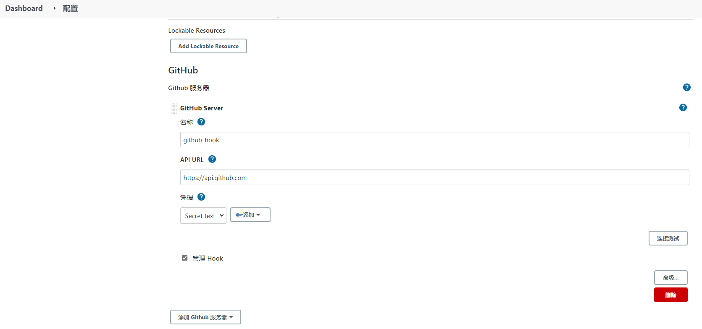

　　弹出的页面中，“kind（类型）"选择"Secret text”，"Secret"填入前面在 GitHub 上生成的 Personal access tokens，Description 随便写一些描述信息，如下图：

　　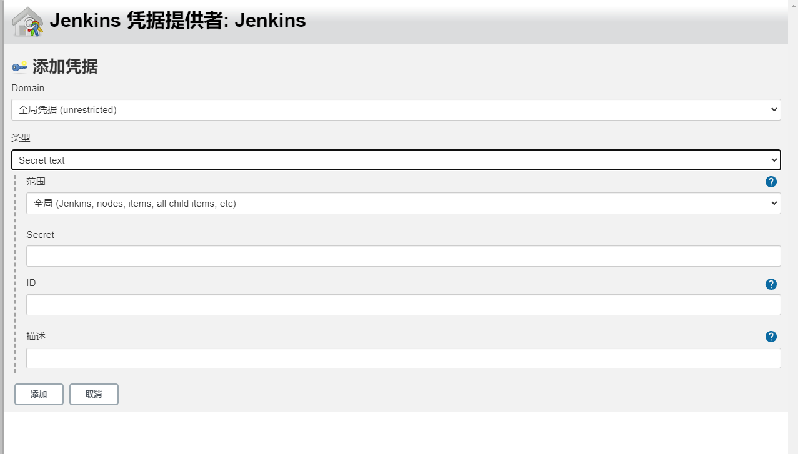

　　填写完毕后，点击右侧的"Test connection"（连接测试）按钮，如果信息没有填错，显示的内容如下图所示：

　　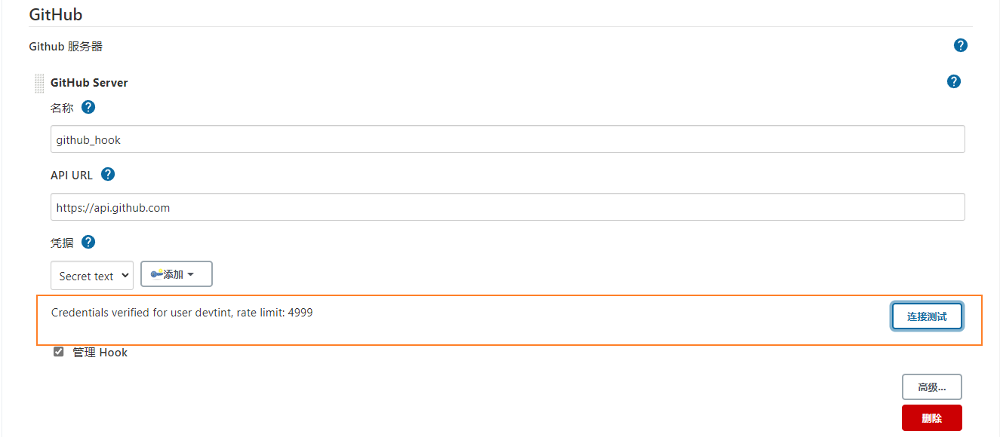

　　

　　**点击页面最底部的"保存"按钮；**

　　GitHub 项目的项目主页和仓库地址  
项目主页和仓库地址是不同的（ HTTPS / SSH 都行）：

　　项目主页：[https://github.com/devtint/car-rental-mobile](https://github.com/devtint/car-rental-mobile)  
仓库地址：[https://github.com/devtint/car-rental-mobile.git](https://github.com/devtint/car-rental-mobile.git) 或 [git@github.com:devtint/car-rental-mobile.git](git@github.com:devtint/car-rental-mobile.git)

　　新建构建项目  
在 Jenkins 上新建一个 maven 构建项目，名为 test003，如下图：

　　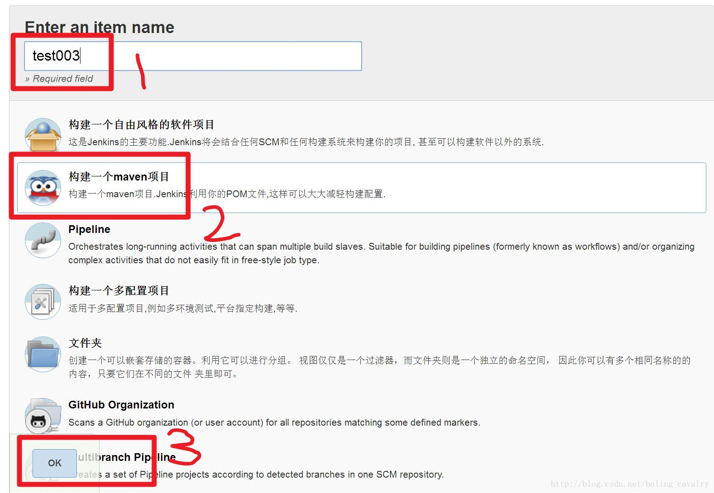

　　接下来设置 test003 的配置信息，分为"源码管理设置"和"构建环境设置"两部分；

### 源码管理设置

　　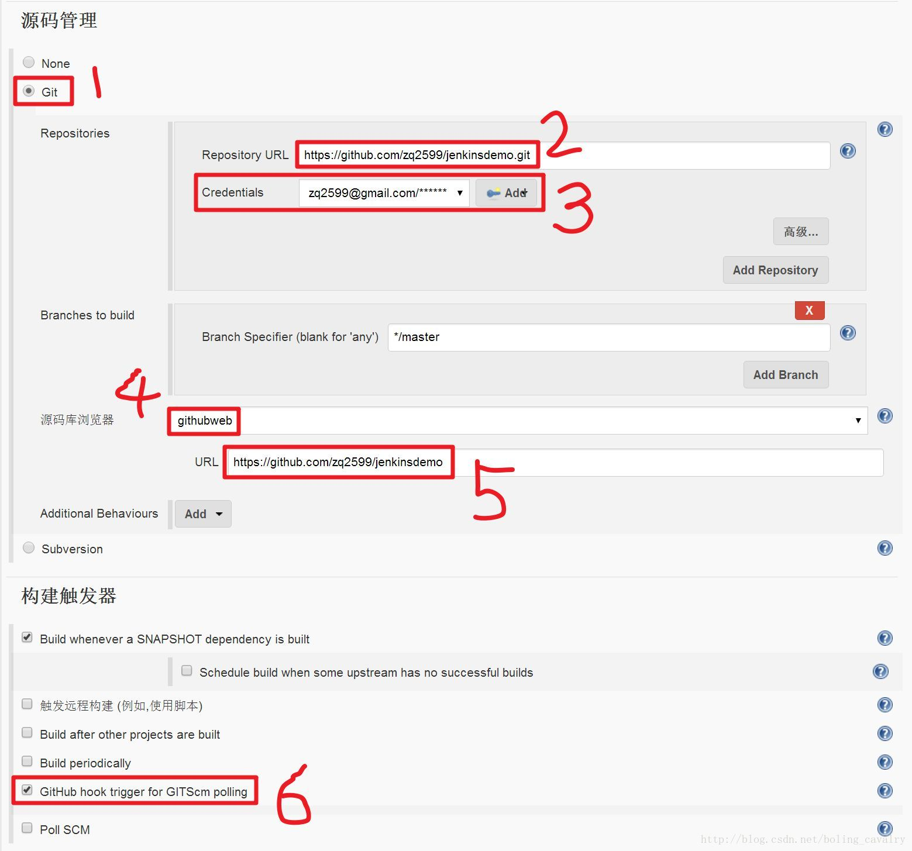

　　上图中每个红框的设置如下解释：

1. 选择"Git"；
2. "Repository URL"输入仓库地址：https://github.com/zq2599/jenkinsdemo.git；
3. “Credentials"创建一个 Credentials，Kind 选择"Username with password”，Username 输入 GitHub 账号 Password 输入 GitHub 密码（推荐使用 token）["... Personal access tokens"](siyuan://blocks/20220104111845-347l5um)；
4. “源码库浏览器"选择"githubweb”；
5. "URL"输入项目主页：https://github.com/zq2599/jenkinsdemo；
6. “构建触发器"中勾选"GitHub hook trigger for GiTScm polling”；

### 构建环境设置

　　  
如下图所示，勾选"Use secret text(s) or file(s)"，下面的"Credentials"选择我们之前配置过的"Personal access tokens"

　　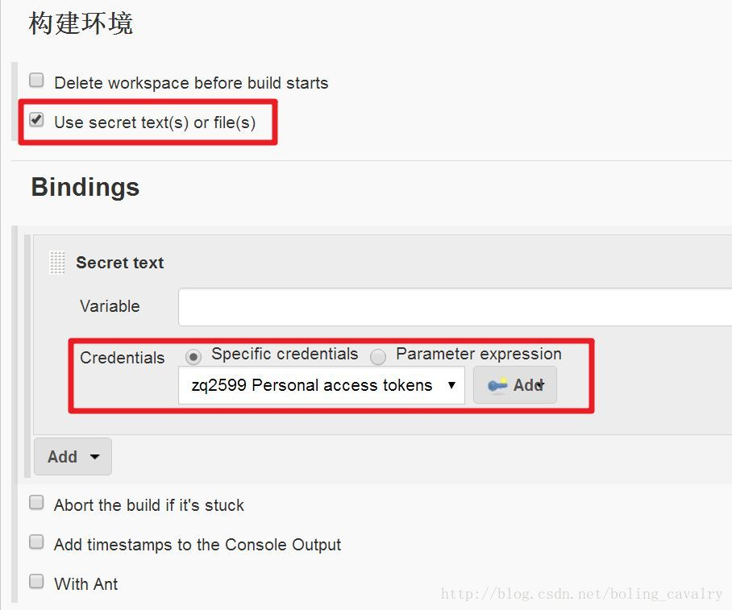

　　设置完成后，点击页面底部的"保存"按钮；

　　

### 修改 web 工程代码并提交到 GitHub

　　将 GitHub 仓库的代码 clone 到本地，做一些修改然后提交到 GitHub 上，

　　Jenkins 自动构建  
回到 Jenkins 的 test003 页面，可以看到已经开始自动构建了，如下图：

　　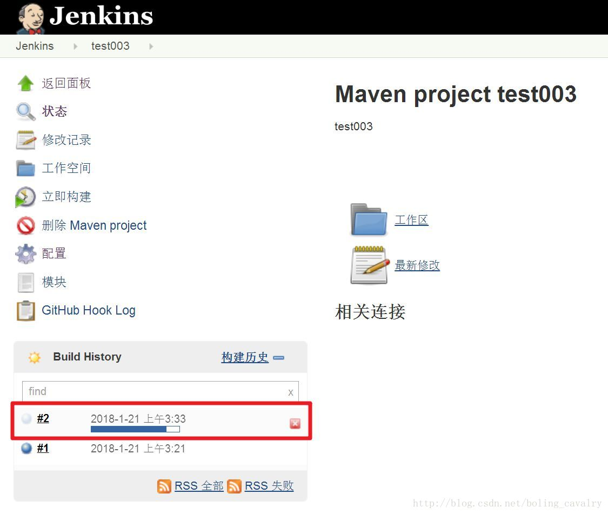

　　至此，GitHub 提交触发 Jenkins 自动构建的实战就完成了

　　
