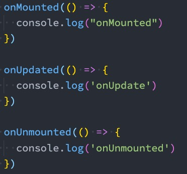

# Mixin

## 认识 Mixin

　　目前我们是使用组件化的方式在开发整个 Vue 的应用程序，但是**组件和组件之间有时候会存在相同的代码逻辑**，我们希望**对相同的代码逻辑进行抽取**。

　　在 Vue2 和 Vue3 中都支持的一种方式就是**使用 Mixin 来完成**：

* Mixin 提供了一种非常灵活的方式，来**分发 Vue 组件中的可复用功能**；
* 一个 Mixin 对象可以包含**任何组件选项**；​
* 当组件使用 **Mixin** 对象时，所有 **Mixin 对象的选项将被混合进入该组件本身的选项​**中；

　　

　　

## Mixin 的基本使用

　　

　　

## Mixin 的合并规则

　　**如果 Mixin 对象中的选项和组件对象中的选项发生了冲突，那么 Vue 会如何操作呢？**

* 这里**分成不同的情况**来进行处理；

　　**情况一：如果是 data 函数的返回值对象**

* 返回值对象默认情况下会**进行合并**；

* 如果 data 返回值对象的属性发生了冲突，那么会**保留组件自身的数据**；

　　**情况二：如何生命周期钩子函数**

* 生命周期的钩子函数**会被合并到数组**中，都会被调用；

　　**情况三：值为对象的选项，例如 methods、components 和 directives，将被合并为同一个对象。**

* 比如都有 **methods 选项**，并且都定义了方法，那么**它们都会生效**；
* 但是如果**对象的 key 相同**，那么**会取组件对象的键值对**；

　　

　　

## 全局混入 Mixin

　　**如果组件中的某些选项，是所有的组件都需要拥有的，那么这个时候我们可以使用****全局的 mixin**：

* 全局的 Mixin 可以使用 **应用 app 的方法 mixin** 来完成注册；

* 一旦注册，那么**全局混入的选项将会影响每一个组件**；
* 

　　

　　

# extends

　　另外一个类似于 Mixin 的方式是**通过 extends 属性**：

* 允许声明扩展另外一个组件，**类似于 Mixins**；

　　

　　

　　在开发中 **extends 用的非常少**，在 **Vue2** 中比较**推荐大家使用 Mixin**，而在 **Vue3** 中**推荐使用 Composition API**

　　

　　

# Options API 的弊端

　　在 **Vue2** 中，我们**编写组件的方式是 Options API**：

* Options API 的一大特点就是在**对应的属性**中编写**对应的功能模块**；

* 比如 **data 定义数据、methods 中定义方法、computed 中定义计算属性、watch 中监听属性改变**，也包括**生命周期钩子**；

　　**但是这种代码有一个很大的弊端：**

* 当我们**实现某一个功能**时，这个功能**对应的代码逻辑**会被**拆分到各个属性**中；

* 当我们**组件变得更大、更复杂**时，**逻辑关注点的列表**就会增长，那么**同一个功能的逻辑就会被拆分的很分散**；

* 尤其对于那些一开始**没有编写这些组件的人**来说，这个组件的代码是**难以阅读和理解**的（阅读组件的其他人）；

　　**下面我们来看一个非常大的组件，其中的逻辑功能按照颜色进行了划分：**

* 这种**碎片化的代码**使用**理解和维护这个复杂的组件变得异常困难**，并且**隐藏了潜在的逻辑问题**；
* 并且当我们**处理单个逻辑关注点**时，需要不断的**跳到相应的代码块**中；

　　

　　

## 大组件的逻辑分散

　　

* 如果我们能将**同一个逻辑关注点相关的代码收集在一起**会更好。

* **这就是 Composition API 想要做的事情，以及可以帮助我们完成的事情。**

* 也有人把 Vue Composition API 简称为 **VCA**。

　　

　　

　　

　　

　　

# 认识 Composition API

　　那么既然知道 Composition API 想要帮助我们做什么事情，接下来看一下到底是怎么做呢？

* 为了开始使用 Composition API，我们需要有一个可以实际使用它**（编写代码）的地方**；

* 在 Vue 组件中，这个位置就是 **setup 函数**；

　　**setup 其实就是组件的另外一个选项：**

* 只不过这个选项强大到我们可以**用它来替代之前所编写的大部分其他选项**；

* 比如 **methods、computed、watch、data、生命周期**等等；

　　**接下来我们一起学习这个函数的使用：**

* 函数的参数

* 函数的返回值

　　

　　

# setup 函数

　　

## setup 函数的参数

　　我们先来研究一个 setup 函数的参数，它主要**有两个参数**：

* 第一个参数：**props**

* 第二个参数：**context**

　　props 非常好理解，它其实就是**父组件传递过来的属性**会被**放到 props 对象**中，我们在 **setup 中如果需要使用**，那就可以直接**通过 props 参数获取**：

* 对于**定义 props 的类型**，我们还是**和之前的规则是一样的**，**在 props 选项中定义**；

* 并且**在 template 中**依然是可以**正常去使用 props 中的属性**，比如 message；

* 如果我们**在 setup 函数中想要使用 props**，那么**不可以通过 this 去获取**（后面我会讲到为什么）；

　　

* 因为 props 有直接**作为参数传递到 setup 函数中**，所以我们可以**直接通过参数来使用**即可；

　　另外一个参数是 context，我们也称之为是一个 **SetupContext**，它里面包含**三个属性：**

* **attrs**：所有的非 prop 的 attribute；
* **slots**：父组件传递过来的插槽（这个在以渲染函数返回时会有作用，后面会讲到）；
* **emit**：当我们组件内部需要发出事件时会用到 emit（因为我们不能访问 this，所以不可以通过 this.$emit 发出事件）；

```html
<template>
  <div>
    Home Page
    <h2>{{message}}</h2>

    <h2>{{title}}</h2>
    <h2>当前计数: {{counter}}</h2>
    <button @click="increment">+1</button>
  </div>
</template>

<script>
  export default {
    props: {
      message: {
        type: String,
        required: true
      }
    },
    data() {
      return {
        counter: 100
      }
    },
    /**
     * 参数一: props, 父组件传递过来属性
     */
    // setup函数有哪些参数?
    // setup函数有什么样的返回值
    // setup(props, context) {
    setup(props, {attrs, slots, emit}) { //解构赋值
      console.log(props.message);
      console.log(attrs.id, attrs.class);
      console.log(slots);
      console.log(emit);

      return {
        title: "Hello Home",
        counter: 100
      }
    },
    methods: {
      btnClick() {
        this.$emit("")
      }
    }
  }
</script>

<style scoped>

</style>
```

　　

　　

　　

## setup 函数的返回值

　　setup 既然是一个函数，那么它也可以有**返回值，它的返回值用来做什么呢**？

* setup 的返回值可以在**模板 template 中被使用**；

* 也就是说我们可以**通过 setup 的返回值来替代 data 选项**；

　　甚至是我们可以**返回一个执行函数**来**代替在 methods 中定义的方法**：

　　

　　但是，如果我们将 counter 在 increment 或者 decrement 进行操作时，**是否可以实现界面的响应式呢**？

* 答案是**不可以**；

* 这是因为对于一个**定义的变量**来说，默认情况下，**Vue 并不会跟踪它的变化，来引起界面的响应式操作**；

　　

```html
<template>
  <div>
    Home Page
    <h2>{{message}}</h2>

    <h2>{{title}}</h2>
    <h2>当前计数: {{counter}}</h2>
    <button @click="increment">+1</button>
  </div>
</template>

<script>
  export default {
    props: {
      message: {
        type: String,
        required: true
      }
    },
    setup() {
      let counter = 100;

      // 局部函数
      const increment = () => {
        counter++;
        console.log(counter);
      }

      return {
        title: "Hello Home",
        counter,
        increment
      }
    }
  }
</script>

<style scoped>

</style>
```

　　

　　

　　

## setup 不可以使用 this

　　官方关于 this 有这样一段描述：

* 表达的含义是 **this 并没有指向当前组件实例**；

* 并且**在 setup 被调用之前，data、computed、methods 等****都没有被解析**；

* 所以**无法在 setup 中获取 this**；

  

　　其实在之前的这段描述是和源码有出入的：

* **之前的描述大概含义是不可以使用 this 是因为组件实例还没有被创建出来**；

　　

　　

## Reactive API

　　如果想为在 setup 中定义的数据提供响应式的特性，那么我们可以**使用 reactive 的函数**：

　　

　　**那么这是什么原因呢？为什么就可以变成响应式的呢？**

* 这是因为当我们**使用 reactive 函数处理我们的数据之后**，数据**再次被使用**时就会**进行依赖收集**；

* 当**数据发生改变**时，所有**收集到的依赖**都是**进行对应的响应式操作**（比如更新界面）；

* 事实上，我们编写的 **data 选项**，也是**在内部交给了 reactive 函数将其编程响应式对象**的；

　　

```html
<template>
  <div>
    Home Page
    <h2>{{message}}</h2>
    <h2>当前计数: {{state.counter}}</h2>
    <button @click="increment">+1</button>
  </div>
</template>

<script>
  import { reactive } from 'vue';

  export default {
    props: {
      message: {
        type: String,
        required: true
      }
    },
    setup() {
      const state = reactive({
        counter: 100
      })

      // 局部函数
      const increment = () => {
        state.counter++;
        console.log(state.counter);
      }

      return {
        state,
        increment
      }
    }
  }
</script>

<style scoped>

</style>
```

　　

　　

### Reactive 判断的 API

　　**isProxy**

* 检查对象是否是由 reactive 或 readonly 创建的 proxy。

　　**isReactive**

* 检查对象是否是由 reactive 创建的响应式代理：

* 如果该代理是 readonly 建的，但包裹了由 reactive 创建的另一个代理，它也会返回 true；

　　**isReadonly**

* 检查对象是否是由 readonly 创建的只读代理。

　　**toRaw**

* 返回 reactive 或 readonly 代理的原始对象（不建议保留对原始对象的持久引用。请谨慎使用）。

　　**shallowReactive**

* 创建一个响应式代理，它跟踪其自身 property 的响应性，但不执行嵌套对象的深层响应式转换 (深层还是原生对象)。

　　**shallowReadonly**

* 创建一个 proxy，使其自身的 property 为只读，但不执行嵌套对象的深度只读转换（深层还是可读、可写的）

　　

　　

## Ref API

　　reactive API 对**传入的类型是有限制的**，它要求我们必须传入的是**一个对象或者数组类型**：

* 如果我们传入一个**基本数据类型（String、Number、Boolean）会报一个警告**；

　　这个时候 Vue3 给我们提供了**另外一个 API**：**ref API**

* ref 会返回一个**可变的响应式对象**，该对象作为一个 **响应式的引用** 维护着它**内部的值**，这就是 **ref 名称的来源**；

* 它内部的值是**在 ref 的 value 属性中**被维护的；
* 

　　**这里有两个注意事项：**

* 在**模板中引入 ref 的值**时，Vue 会**自动帮助我们进行解包操****作**，所以我们并**不需要在模板中通过 ref.value** 的方式来使用；

* 但是**在 setup 函数内部**，它依然是一个 **ref 引用**， 所以对其进行操作时，我们依然需要**使用 ref.value 的方式**；

　　

```html
<template>
  <div>
    Home Page
    <h2>{{message}}</h2>
    <!-- 当我们在template模板中使用ref对象, 它会自动进行解包 -->
    <h2>当前计数: {{counter}}</h2>
    <button @click="increment">+1</button>

    <show-message :message="counter"></show-message>
  </div>
</template>

<script>
  import { ref } from 'vue';

  export default {
    props: {
      message: {
        type: String,
        required: true
      }
    },
    setup() {
      // counter编程一个ref的可响应式的引用
      // counter = 100;
      let counter = ref(100);

      // 局部函数
      const increment = () => {
        counter.value++;
        console.log(counter.value);
      }

      return {
        counter,
        increment
      }
    }
  }
</script>

<style scoped>

</style>
```

　　

### Ref 自动解包

　　**模板中的解包是浅层的解包**，如果我们的代码是下面的方式：

　　如果我们**将 ref 放到一个 reactive 的属性**当中，那么**在模板中使用时，它会自动解包**：

　　

　　

```html

<template>
  <div>
    Home Page
    <h2>{{message}}</h2>
    <!-- 当我们在template模板中使用ref对象, 它会自动进行解包 -->
    <h2>当前计数: {{counter}}</h2>
    <!-- ref的解包只能是一个浅层解包(info是一个普通的JavaScript对象) -->
    <h2>当前计数: {{info.counter.value}}</h2>
    <!-- 当如果最外层包裹的是一个reactive可响应式对象, 那么内容的ref可以解包 -->
    <h2>当前计数: {{reactiveInfo.counter}}</h2>
    <button @click="increment">+1</button>
  </div>
</template>

<script>
  import { ref, reactive } from 'vue';

  export default {
    props: {
      message: {
        type: String,
        required: true
      }
    },
    setup() {
      let counter = ref(100);

      const info = {
        counter
      }

      const reactiveInfo = reactive({
        counter
      })

      // 局部函数
      const increment = () => {
        counter.value++;
        console.log(counter.value);
      }

      return {
        counter,
        info,
        reactiveInfo,
        increment
      }
    }
  }
</script>

<style scoped>

</style>
```

　　

　　

### toRefs

　　如果我们使用 **ES6 的解构语法**，对 **reactive 返回的对象进行解构获取值**，那么之后无论是**修改结构后的变量**，还是**修改 reactive返回的 state 对象**，**数据都不再是响应式**的：

　　

　　那么有没有办法**让我们解构出来的属性是响应式**的呢？

* Vue 为我们提供了一个 **toRefs 的函数**，可以将 **reactive 返回的对象中的属性都转成 ref**；

* 那么我们再次进行结构出来的 **name 和 age 本身都是 ref** 的；
* 

　　这种做法相当于已经在 **state.name** 和 **ref.value** 之间**建立了 链接**，**任何一个修改都会引起另外一个变化**；

　　

### toRef

　　如果我们只希望**转换一个 reactive 对象中的属性为 ref**, 那么可以**使用 toRef 的方法**：

　　

　　

　　

### ref 其他的 API

**isRef**


* 判断值**是否是一个 ref 对象**。


　　**unref**

* 如果我们想要**获取一个 ref 引用中的 value**，那么也可以**通过 unref 方法**：

* **如果参数是一个 ref**，则**返回内部值，否则返回参数本身**；

* 这是 **val = isRef(val) ? val.value : val** 的语法糖函数；

　　**shallowRef**

* 创建一个**浅层的 ref 对象**；

　　**triggerRef**

* **手动触发和 shallowRef 相关联的副作用**：

　　

　　

　　

　　

#### customRef

　　创建一个**自定义的 ref**，并**对其依赖项跟踪和更新触发进行显示控制**：

* 它需要**一个工厂函数**，该**函数接受 track 和 trigger 函数**作为参数；

* 并且应该返回**一个带有 get 和 set 的对象**；

　　这里我们使用一个的案例：

* 对**双向绑定的属性进行 debounce(节流)**的操作；

　　

　　案例


　　

　　

## 认识 readonly

　　我们通过 **reactive 或者 ref 可以获取到一个响应式的对象**，但是某些情况下，我们**传入给其他地方（组件）**的这个响应式对象希望**在另外一个地方（组件）被使用**，但是**不能被修改**，这个时候**如何防止这种情况的出现**呢？

* Vue3 为我们提供了 **readonly 的方法**；
* **readonly 会返回原生对象的只读代理**（也就是它依然是一个 Proxy，这是一个 **proxy 的 set 方法被劫持**，并且不能对其进行修改）；

　　**在开发中常见的 readonly 方法会传入三个类型的参数：**

* 类型一：**普通对象**；
* 类型二：**reactive 返回的对象**；
* 类型三：**ref 的对象**；

　　

　　

### readonly 的使用

　　**在 readonly 的使用过程中，有如下规则：**

* readonly **返回的对象都是不允许修改**的；

* 但是经过 readonly 处理的**原来的对象**是允许被修改的；

　　		比如 const info = readonly(obj)，**info 对象是不允许被修改**的；

　　		当 **obj 被修改**时，**readonly 返回的 info 对象**也会被修改；

　　		但是我们**不能去修改 readonly 返回的对象 info**；

* 其实本质上就是 **readonly 返回的对象的 setter 方法被劫持了**而已；

　　

　　

　　

### readonly 的应用

　　**那么这个 readonly 有什么用呢？**

* 在我们传递给其他组件数据时，往往希望其他组件使用我们传递的内容，但是不允许它们修改时，就可以使用

　　readonly 了；

　　

　　

　　

　　

　　

## setup 中 computed 的使用

　　在前面我们讲解过计算属性 computed：当我们的某些属性是依赖其他状态时，我们可以使用计算属性来处理

* 在前面的 Options API 中，我们是使用 computed 选项来完成的；

* 在 Composition API 中，我们可以在 setup 函数中使用 computed 方法来编写一个计算属性；

　　如何使用 computed 呢？

* 方式一：接收一个 getter 函数，并为 getter 函数返回的值，返回一个不变的 ref 对象；

* 方式二：接收一个具有 get 和 set 的对象，返回一个可变的（可读写）ref 对象；


　　

　　

　　

## setup 中 watch 的使用

---

　　**侦听数据的变化**

　　在前面的 Options API 中，我们可以通过 watch 选项来侦听 data 或者 props 的数据变化，当数据变化时执行某一些操作。

　　在 Composition API 中，我们可以使用 watchEffect 和 watch 来完成响应式数据的侦听；

* watchEffect 用于自动收集响应式数据的依赖；
* watch 需要手动指定侦听的数据源；

　　

　　

### watchEffect

　　当侦听到某些响应式数据变化时，我们希望执行某些操作，这个时候可以使用 watchEffect。

#### watchEffect 的基本使用

　　我们来看一个案例：

* 首先，**watchEffect 传入的函数会被立即执行一次**，并且**在执行的过程中会收集依赖**；

* 其次，只有收集的**依赖发生变****化**时，watchEffect 传入的函数才会再次执行；

　　

　　

　　

#### watchEffect 的停止侦听

　　如果在发生某些情况下，我们希望停止侦听，这个时候我们可以获取 watchEffect 的返回值函数，调用该函数即可。

　　比如在上面的案例中，我们 age 达到 20 的时候就停止侦听：

　　

　　

　　

　　

#### watchEffect 清除副作用

　　什么是清除副作用呢？

* 比如在开发中我们需要在侦听函数中执行网络请求，但是在网络请求还没有达到的时候，我们停止了侦听器，或者侦听器侦听函数被再次执行了。

* 那么上一次的网络请求应该被取消掉，这个时候我们就可以清除上一次的副作用；

　　在我们给 watchEffect 传入的函数被回调时，其实可以获取到一个参数：onInvalidate

* 当**副作用即将重新执行** 或者 **侦听器被停止** 时会执行该函数传入的回调函数；

* 我们可以在传入的回调函数中，执行一些清楚工作；

　　

　　

　　

#### watchEffect 的执行时机

##### setup 中使用 ref

　　在讲解 watchEffect 执行时机之前，我们先补充一个知识：在 setup 中如何使用 ref 获取元素或者组件？

* 其实非常简单，我们只需要定义一个 ref 对象，绑定到元素或者组件的 ref 属性上即可；

　　

　　

　　

##### watchEffect 的执行时机

　　默认情况下，组件的更新会在副作用函数执行之前：

* 如果我们希望在副作用函数中获取到元素，是否可行呢？


　　我们会发现打印结果打印了两次：

* 这是因为 setup 函数在执行时就会立即执行传入的副作用函数，这个时候 DOM 并没有挂载，所以打印为 null；

* 而当 DOM 挂载时，会给 title 的 ref 对象赋值新的值，副作用函数会再次执行，打印出来对应的元素；

　　

##### 调整 watchEffect 的执行时机

　　如果我们希望在第一次的时候就打印出来对应的元素呢？

* 这个时候我们需要改变副作用函数的执行时机；
* 它的默认值是 pre（有pre, post , sync），它会在元素 挂载 或者 更新 之前执行；
* 所以我们会先打印出来一个空的，当依赖的 title 发生改变时，就会再次执行一次，打印出元素；

　　我们可以设置副作用函数的执行时机：调整为 post

　　

> flush 选项还接受 sync，这将强制效果始终同步触发。然而，这是低效的，应该很少需要。
>

　　

　　

　　

### watch

#### Watch 的使用

　　watch 的 API 完全等同于组件 watch 选项的 Property：

* watch 需要侦听特定的数据源，并在回调函数中执行副作用；

* 默认情况下它是惰性的，只有当被侦听的源发生变化时才会执行回调；

　　与 watchEffect 的比较，watch 允许我们：

* 懒执行副作用（第一次不会直接执行）；

* 更具体的说明当哪些状态发生变化时，触发侦听器的执行；

* 访问侦听状态变化前后的值；

　　

#### 侦听单个数据源

　　watch 侦听函数的数据源有两种类型：

* 一个 getter 函数：但是该 getter 函数必须引用可响应式的对象（比如 reactive 或者 ref）；

* 直接写入一个可响应式的对象，reactive 或者 ref（比较常用的是 ref）；


　　

　　

#### 侦听多个数据源

　　侦听器还可以使用数组同时侦听多个源：

　　

　　

　　

#### 侦听响应式对象

　　如果我们希望侦听一个数组或者对象，那么可以使用一个 getter 函数，并且对可响应对象进行解构：

　　

　　

　　

#### watch 的选项

　　如果我们希望侦听一个深层的侦听，那么依然需要设置 deep 为 true：

* 也可以传入 immediate 立即执行；

　　

　　

　　

## setup 中的 生命周期钩子

---

　　我们前面说过 setup 可以用来替代 data 、 methods 、 computed 、watch 等等这些选项，也可以替代 生命周期钩子。

　　那么 setup 中如何使用生命周期函数呢？

* 可以使用直接导入的 onX 函数注册生命周期钩子；

			


　　

　　

　　

　　

## Provide 和 Inject

---

　　

### provide 函数

　　事实上我们之前还学习过 Provide 和 Inject，Composition API 也可以替代之前的 Provide 和 Inject 的选项。

　　我们可以通过 provide 来提供数据：

* 可以通过 provide 方法来定义每个 Property；
* provide 可以传入两个参数：

　　	- name：提供的属性名称；

　　	- value：提供的属性值；

　　

　　

　　

### inject 函数

　　在 后代组件 中可以通过 inject 来注入需要的属性和对应的值：

* 可以通过 inject 来注入需要的内容；

* inject 可以传入两个参数：

　　	√ 要 inject 的 property 的 name；

　　	√ 默认值；

　　

　　

　　

### 数据的响应式

　　为了增加 provide 值和 inject 值之间的响应性，我们可以在 provide 值时使用 ref 和 reactive

　　

　　

　　

### 修改响应式 Property

　　如果我们需要修改可响应的数据，那么最好是在数据提供的位置来修改：

* 我们可以将修改方法进行共享，在后代组件中进行调用；

　　

　　

　　

# Composition API 练习

## useCounter

　　App.vue

```html
<template>
  <div>
    <h2>当前计数: {{ counter }}</h2>
    <h2>双倍计数: {{ doubleCounter }}</h2>
    <button @click="increment">+1</button>
    <button @click="decrement">-1</button>
  </div>
</template>
```

```js
<script>
// import { ref, computed } from 'vue'
import useContext from './hooks/useCounter'


export default {
  setup() {
    const { counter, doubleCounter, increment, decrement } = useContext()

    return {
      counter,
      doubleCounter,
      increment,
      decrement,
    }
  },
}
</script>
```

　　./hooks/useCounter.js

```js
import { ref, computed } from 'vue'

export default function () {
  const counter = ref(0)
  const doubleCounter = computed(() => counter.value * 2)

  const increment = () => counter.value++
  const decrement = () => counter.value--

  return {
    counter,
    doubleCounter,
    increment,
    decrement,
  }
}
```

　　

## useTitle

　　App.vue

```html
<script>
//import { ref, computed } from 'vue'
import useTitle from './hooks/useTitle'

export default {
  setup() {

    const titleRefs = useTitle('default title')
    setTimeout(() => {
      titleRefs.value = "tint"
    }, 3000)

    return {
 
    }
  },
}
</script>
```

　　./hooks/useTitle.js

```js
import { ref, watch } from 'vue'

export default function (title = '默认title') {
  const titleRef = ref(title)
  watch(titleRef,(newValue) => {
      document.title = newValue
    },
    {
      immediate: true
    }
  )
  return {
    titleRef,
  }
}

```

## useScrollPosition

　　我们来完成一个监听界面滚动位置的 Hook：

　　

　　

　　

## useMousePosition

　　我们来完成一个监听鼠标位置的 Hook：

　　

　　

　　

　　

　　

　　

## setup 顶层编写方式 <script setup>

　　`<script setup></script>`

　　[Vue3 docs | script setup](https://v3.cn.vuejs.org/api/sfc-script-setup.html#%E5%9F%BA%E6%9C%AC%E8%AF%AD%E6%B3%95)

　　#待补充#

　　#script setup#

　　
